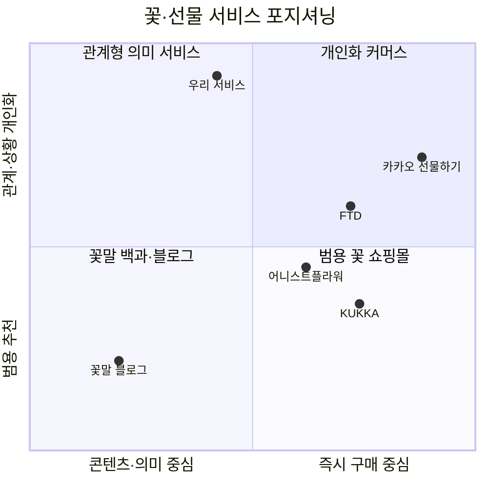
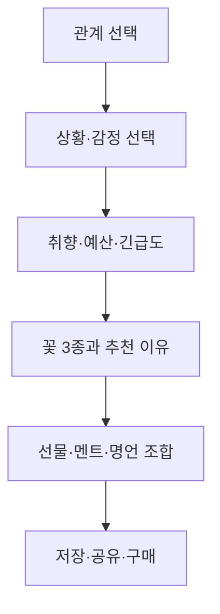
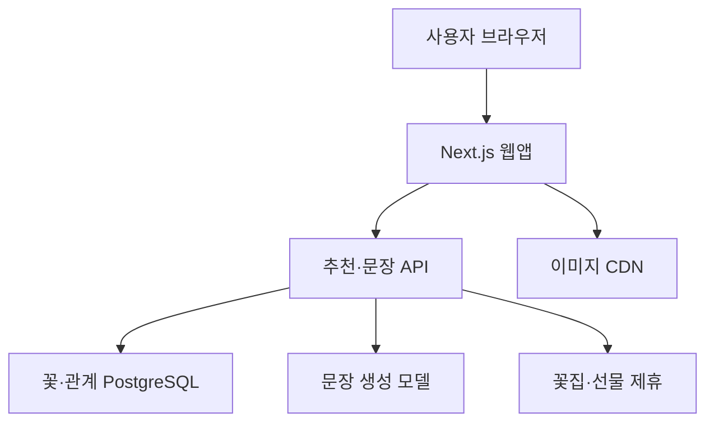
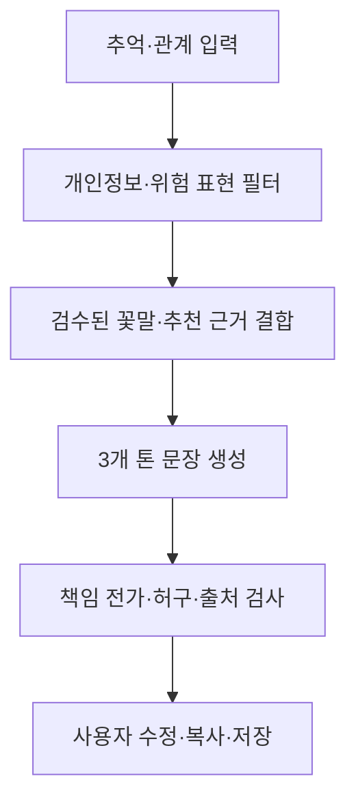

# 꽃말 기반 관계형 선물 추천 서비스 — 경쟁사 분석·디자인 레퍼런스·제품 기획안

조사일: 2026-08-14  
기획 단계: 아이디어 검증 및 MVP 설계  
조사 범위: 국내외 꽃 커머스, 꽃말 콘텐츠, 선물 추천 서비스, 사과·화해 경험, 고화질 이미지 운영

---

## 문서 구성

| 요청 항목 | 이 문서에서 볼 곳 |
|---|---|
| 기획안 | Part I — 문제, 고객, 기능, UX, 디자인, BM, MVP |
| 구현 방법 | Part II — 기술 구조, 추천 로직, 추억 기반 멘트, API, 데이터, 테스트 |
| 평가 및 발전요소 | Part III — 냉정한 평가, 검증 기준, 단계별 확장, 꽃 산업 연계 |
| 조사 정리 | Part IV — 국내외 사례와 디자인 레퍼런스의 핵심 결론 |

# Part I. 기획안

## 0. 한 문장 결론

이 서비스는 **꽃을 판매하는 쇼핑몰**보다 먼저, **관계와 상황을 입력하면 ‘무슨 마음을 어떤 꽃·선물·문장으로 전할지’ 알려주는 관계형 선물 컨시어지**로 시작하는 것이 가장 유리하다.

시장에서 비어 있는 부분은 꽃말 정보 자체가 아니다. 꽃말 콘텐츠는 국내외 꽃 쇼핑몰과 블로그에 이미 많다. 그러나 다음 요소를 한 흐름으로 묶은 서비스는 찾기 어렵다.

> **관계 선택 → 상황·감정 파악 → 꽃말이 맞는 꽃 추천 → 함께 줄 선물 추천 → 실제로 쓸 멘트·명언 생성 → 구매·공유**

특히 다음 세 기능이 차별화의 핵심이다.

1. **사과·화해 모드**: “얼마나 잘못했는지”와 잘못의 유형에 따라 꽃과 사과문, 후속 행동을 추천
2. **관계별 꽃말 번역**: 같은 꽃말도 연인·배우자·썸·친구·가족·동료에게 다르게 풀어 설명
3. **여러 명에게 전하기**: 친구·동아리·팀원별 꽃·꽃말·멘트·명언을 만들고 전체를 하나의 ‘팀 부케’로 시각화

초기 타깃은 **꽃을 잘 모르지만 연인·배우자에게 센스 있게 마음을 전하고 싶은 23~39세 남성**으로 좁히는 것이 효율적이다. 다만 서비스 언어와 화면은 누구나 사용할 수 있도록 성별 중립적으로 설계한다.

---

## 1. 아이템 정의

### 1.1 서비스 포지셔닝

| 항목 | 정의 |
|---|---|
| 카테고리 | 관계형 꽃·선물 추천 플랫폼 / 감정 전달 컨시어지 |
| 핵심 고객 | 꽃을 고르는 기준과 멘트 작성이 어려운 선물 구매자 |
| 핵심 문제 | “무슨 꽃이 맞는지”, “이 꽃말이 이 관계에 괜찮은지”, “뭐라고 써야 하는지”를 따로 찾아야 함 |
| 해결 방식 | 관계·상황·취향·예산·긴급도를 받아 꽃, 꽃말, 선물, 멘트, 행동을 한 번에 추천 |
| 초기 BM | 콘텐츠·추천 서비스 + 제휴 링크/주문 전환 수수료 |
| 장기 BM | 제휴 꽃집 주문 중개, B2B 추천 위젯, 다중 수신자 카드 제작, 프리미엄 관계 리마인더 |

### 1.2 추천 가치제안 문구

가장 이해가 빠른 문구는 다음과 같다.

> **하고 싶은 말부터 고르면, 꽃이 대신 말해드려요.**

보조 문구:

> 관계와 상황을 알려주세요. 어울리는 꽃과 꽃말, 함께 줄 선물, 진짜로 쓸 수 있는 멘트까지 골라드릴게요.

사과 모드 전용 문구:

> **꽃이 사과를 대신할 수는 없지만, 진심을 전하는 데는 도움이 될 수 있어요.**

이 문장이 중요한 이유는 사과 선물을 만능 해결책처럼 판매하지 않으면서도 서비스 필요성을 인정하기 때문이다.

---

## 2. 시장과 기회

### 2.1 확인된 시장 신호

- 농촌진흥청 국립원예특작과학원 통계상 2024년 국내 화훼 생산액은 약 **5,380억 원**, 이 중 절화류 판매금액은 약 **1,889억 원**이다. 이는 소비자 거래액 전체가 아니라 국내 생산 측 지표이므로 TAM으로 그대로 쓰면 안 된다. [국립원예특작과학원 화훼 기본통계](https://www.nihhs.go.kr/farmer/statistics/statistics.do?t_cd=0204)
- 2025년 12월 17일까지 카카오톡 선물하기 이용 횟수는 약 **1억8,950만 건**으로 보도됐다. 꽃에 한정된 수치는 아니지만, 모바일에서 관계 기반 선물을 탐색하고 보내는 행동이 이미 대중화됐음을 보여주는 강한 간접 신호다. [연합뉴스TV, 2025년 카카오톡 선물 이용 데이터](https://www.yonhapnewstv.co.kr/news/AKR20251225090439d8x)
- 민간 설문인 PocketSurvey 조사에서는 응답자의 **52.3%가 그때그때 다른 꽃집**에서 꽃을 구매했고, 온라인 주문은 **15.8%**였다. 표본과 조사 방법이 공식 통계만큼 상세히 공개된 자료는 아니므로 방향성 자료로만 봐야 하지만, 꽃 구매처 충성도가 낮고 발견 과정이 분산돼 있다는 가설을 뒷받침한다. [PocketSurvey 꽃 소비 트렌드](https://home.pocketsurvey.co.kr/%EA%BD%83-%EC%86%8C%EB%B9%84-%EB%B0%8F-%EC%A6%89%EC%84%9D-%EC%82%AC%EC%A7%84-%ED%8A%B8%EB%A0%8C%EB%93%9C-%EB%A6%AC%ED%8F%AC%ED%8A%B8/)

### 2.2 기회의 정확한 정의

“꽃말을 정리한 사이트가 없다”는 표현은 경쟁사 조사 후 다음처럼 수정하는 것이 정확하다.

> **꽃말 자료는 많지만, 출처·문화권·색상 차이를 구분하고 이를 관계·상황·멘트·실제 구매로 연결하는 한국어 서비스는 부족하다.**

이 차이가 중요하다. 단순 꽃말 백과는 검색 유입은 만들 수 있어도 쉽게 복제된다. 반면 **꽃말을 실제 선물 결정으로 바꾸는 데이터와 UX**는 다음과 같은 누적 자산을 만든다.

- 어떤 관계에서 어떤 꽃이 선택됐는가
- 어떤 추천 이유가 구매를 만들었는가
- 어떤 멘트 톤이 저장·공유됐는가
- 수신자가 좋아했는지, 다음 추천에서 무엇을 바꿔야 하는가
- 계절과 지역별로 실제 구매 가능한 꽃은 무엇인가

이 데이터가 장기적인 추천 품질과 제휴 꽃집 네트워크의 기반이 된다.

---

## 3. 경쟁사 분석

### 3.1 국내 직접·인접 경쟁사

| 서비스 | 현재 제공 가치 | 배울 점 | 우리 서비스가 파고들 틈 |
|---|---|---|---|
| [어니스트플라워](https://honestflower.kr/home) | 꽃 선물, 정기구독, 꽃시장, 매거진, ‘꽃도감’을 한 브랜드 안에서 운영 | 국내에서 콘텐츠와 커머스를 가장 자연스럽게 연결한 사례. 메뉴에 꽃도감을 독립 항목으로 둠 | 꽃도감은 강하지만 관계·상황·사과 강도에 따른 의사결정 엔진과 멘트 생성은 중심 기능이 아님 |
| [KUKKA 꾸까](https://kukka.kr/) | 꽃 정기구독, 꽃시장, 선물, 클래스, 콘텐츠를 통한 ‘꽃의 일상화’ | 꽃을 특별한 날의 사치가 아니라 라이프스타일로 재정의한 브랜드 언어와 시즌 콘텐츠 | 구독·상품 중심. “이 관계에서 왜 이 꽃이어야 하는지”를 해결하는 관계형 추천은 약함 |
| [꽃집청년들](https://www.f-mans.com/) | 전국 당일 배송, 상품 카테고리, 리뷰, 정기구독, 케이크 등 추가 선물 | 빠른 배송, 리뷰, 실물 주문 신뢰, 명화 컬렉션 같은 상품 테마화. 조사 시점 추천 꽃 상품은 약 5만~10만 원대가 중심 | 전환에는 강하지만 상품 수가 많아 꽃을 모르는 사용자는 여전히 무엇을 골라야 할지 고민해야 함. 꽃말·멘트는 핵심 탐색 축이 아님 |
| [카카오톡 선물하기](https://www.kakaocorp.com/page/service/service/KakaoTalkGift) | 성별·연령·가격·테마별 랭킹, 위시리스트, 선물 이력, 메시지카드, 구매·전송 | 선물 선택부터 전송까지의 마찰이 가장 적음. AI 선물탐험은 성별·연령·선물 유형과 이력을 조합하고 추천 사유까지 제시 | 범용 선물 플랫폼이라 꽃의 의미·문화·색상·안전성까지 깊게 설명하기 어렵고, 사과나 관계 회복을 위한 대화 설계는 없음 |

카카오는 AI 선물탐험에서 수신자의 공개 위시리스트, 주고받은 선물 이력, 인기 위시 상품, 사용자가 고른 성별·연령·선물 유형을 조합하고 **추천 사유**를 붙인다. 우리 서비스도 결과만 나열하지 말고 “왜 이 사람에게 이 꽃인지”를 반드시 보여줘야 한다. [카카오 AI 선물탐험 설명](https://www.kakaocorp.com/page/detail/10878)

### 3.2 해외 직접·인접 경쟁사

| 서비스 | 현재 제공 가치 | 배울 점 | 우리 서비스가 파고들 틈 |
|---|---|---|---|
| [Bloom & Wild](https://www.bloomandwild.com/) | 꽃·식품·카드·구독을 상황별로 큐레이션. Apology 카드 카테고리도 보유 | ‘꽃’보다 ‘돌봄과 마음’을 파는 브랜드. 생일·감사·로맨스·사과 등 의도 중심 정보구조 | 꽃말은 주로 에디토리얼 콘텐츠이며 개인 관계별 생성형 추천으로 이어지지 않음 |
| [UrbanStems](https://urbanstems.com/) | 색상·꽃·상황 검색, 현대적 부케, 꽃+와인·화병 등 페어링 | 첫 검색부터 color/flower/occasion을 제시하고, 상품 카드에서 가격·리뷰를 비교하기 쉬움 | 상품 탐색에는 강하지만 의미와 관계 서사는 약함. 조사 시점 주요 상품은 약 $60~$215 |
| [FTD](https://www.ftd.com/) | 대형 꽃배달 네트워크와 꽃말·상황별 SEO 콘텐츠 | 사과 꽃 콘텐츠에서 연인·친구·가족별 적합 꽃을 구분함. 상품 콘텐츠가 바로 구매로 이어짐 | 글 단위 안내가 많고, 사용자의 구체적 잘못·관계·말투를 반영하는 인터랙티브 경험은 약함 |
| [FLOWERBX](https://www.flowerbx.com/us/) | 럭셔리 단일 품종 부케, 패션 중심 이미지, 구독·행사·기업 선물 | 한 화면에 한 꽃을 크게 보여주는 사진 연출, 절제된 타이포, 높은 객단가를 납득시키는 에디토리얼 톤 | 개인화와 꽃말 탐색보다 럭셔리 커머스가 중심 |
| [Ode à la Rose](https://www.odealarose.com/) | 프렌치 감성의 프리미엄 꽃과 시그니처 박스, 발송 전 실제 부케 사진 제공 | ‘받는 순간’까지 디자인함. 실제 제작 꽃 사진을 보내 기대-실물 불일치 불안을 낮춤 | 관계·꽃말·멘트 추천은 보조적 |
| [The Bouqs Co.](https://bouqs.com/) | 농장 직송, 계절 꽃, 구독, 지속가능성, 현대적 부케 | 꽃이 봉오리 상태로 도착해 피어나는 경험까지 가치로 설명. 생산자·신선도 스토리텔링 | 관계에 맞는 의미 추천보다 상품·유통 가치가 중심 |
| [Uncommon Goods Gift Finder](https://www.uncommongoods.com/gift-finder/form) | 관계와 관심사를 받은 뒤 추천하고, 사용자가 별표를 누를수록 결과를 다시 정렬 | 추천을 한 번에 끝내지 않고 사용자의 즉각적 피드백으로 큐를 진화시킴 | 꽃과 감정 전달에는 특화돼 있지 않음 |

FTD는 사과 꽃으로 분홍 장미, 흰 난초, 분홍 카네이션, 푸른 히아신스, 흰 튤립 등을 제안하며 연인·친구·가족별 적합성을 나눈다. 이는 “관계별 꽃말 번역” 수요가 실제 커머스 콘텐츠에도 존재한다는 사례다. 다만 이런 의미는 보편적 과학 사실이 아니라 문화적 상징이므로 출처와 문화권을 함께 표시해야 한다. [FTD 사과 꽃 가이드](https://www.ftd.com/blog/apology-flowers)

### 3.3 기능 경쟁력 정성 평가

아래 점수는 각 회사가 공개한 사이트를 2026-08-14 기준으로 살펴본 **기획용 정성 평가**이며 공식 평가가 아니다. 5점에 가까울수록 해당 기능이 강하다.

| 서비스 | 꽃말 깊이 | 관계 개인화 | 사과·화해 | 멘트 지원 | 구매 편의 | 시각 완성도 | 다중 수신자 |
|---|---:|---:|---:|---:|---:|---:|---:|
| 어니스트플라워 | 4 | 2 | 1 | 1 | 4 | 4 | 1 |
| KUKKA | 2 | 2 | 1 | 1 | 4 | 4 | 1 |
| 꽃집청년들 | 1 | 2 | 1 | 1 | 5 | 3 | 2 |
| 카카오 선물하기 | 1 | 4 | 1 | 3 | 5 | 3 | 2 |
| Bloom & Wild | 3 | 3 | 2 | 3 | 5 | 5 | 2 |
| FTD | 4 | 3 | 4 | 2 | 5 | 3 | 2 |
| Uncommon Goods | 1 | 5 | 1 | 1 | 5 | 4 | 1 |
| FLOWERBX / Ode | 1 | 2 | 1 | 2 | 4 | 5 | 1 |
| **우리의 목표** | **5** | **5** | **5** | **5** | **4** | **5** | **5** |

### 3.4 포지셔닝 지도



결론적으로 우리 서비스가 차지해야 할 자리는 **관계형 의미 서비스**다. 초기에 직접 재고와 배송까지 떠안기보다 이 위치에서 추천과 콘텐츠를 장악한 뒤 커머스로 내려오는 전략이 합리적이다.

---

## 4. 가장 중요한 차별화: 꽃말을 ‘사실’처럼 단정하지 않기

꽃말은 문화·시대·저자·색상에 따라 달라진다. Royal Horticultural Society의 자료는 프랑스에서 시작된 19세기 꽃말 전통이 영국과 미국으로 건너가며 종교적·성적 의미가 수정됐고, 같은 꽃도 책마다 다른 의미를 가졌다고 설명한다. [RHS Lindley Library의 꽃말 역사](https://artsandculture.google.com/story/the-language-of-flowers-royal-horticultural-society/DQXBY7DfLX9RIg?hl=en)

Cornell University Library는 Kate Greenaway의 1884년 저서가 700개 이상의 꽃과 식물을 1~3단어 의미로 정리한 빅토리아 시대 후반 자료라고 소개한다. [Cornell Written in Petals](https://exhibits.library.cornell.edu/written-in-petals/feature/language-of-flowers-kate-greenaway) 원문은 Project Gutenberg에서도 무료로 열람할 수 있다. [Kate Greenaway, Language of Flowers](https://www.gutenberg.org/ebooks/31591)

따라서 한 꽃에 “정답 꽃말 하나”만 적기보다 다음 구조가 신뢰를 만든다.

### 4.1 권장 꽃말 카드 구조

| 필드 | 예시 |
|---|---|
| 꽃 | 흰 튤립 |
| 대표 의미 | 용서, 새로운 시작, 진심 |
| 문화·출처 | 현대 영미권 플로리스트 가이드 / 빅토리아 꽃말 자료 |
| 신뢰 라벨 | 여러 현대 자료에서 반복됨 / 자료 간 차이 있음 |
| 관계별 해석 | 연인: 다시 솔직하게 시작하고 싶어 / 친구: 서운하게 해서 미안해, 다시 편하게 지내고 싶어 |
| 주의 의미 | 색상·문화에 따라 다른 뜻이 소개되기도 함 |
| 추천 이유 | 사과를 대신하지 않으면서 ‘새 출발’을 상징하기 좋음 |
| 실제 구매 가능성 | 봄철 높음 / 그 외 계절 대체 꽃 제안 |

### 4.2 데이터 원칙

- **식물명·학명·동의어**: 국립수목원 국가생물종지식정보시스템과 Royal Botanic Gardens, Kew의 Plants of the World Online을 기본 축으로 삼는다. POWO는 현재 145만 개 이상의 식물명과 50만 개 이상의 이미지를 제공한다. [Kew Plants of the World Online](https://powo.science.kew.org/)
- **꽃말**: 한국 기관 자료, 역사 문헌, 현대 플로리스트 자료를 분리 저장한다.
- **LLM 사용 범위**: 확인된 꽃말을 관계와 말투에 맞게 바꾸는 데만 사용한다. 꽃말·독성·계절 정보를 모델이 즉석에서 만들게 하지 않는다.
- **편집 검수**: 플로리스트 또는 원예 전공자 검수 여부와 수정일을 카드에 표시한다.

이 방식은 단순 꽃말 모음보다 제작 비용이 높지만, 바로 그 점이 진입 장벽이 된다.

---

## 5. 핵심 사용자와 사용 시나리오

### 5.1 1차 타깃

| 항목 | 내용 |
|---|---|
| 연령 | 23~39세 |
| 상황 | 연애 중이거나 결혼한 남성, 꽃 선물 경험이 적음 |
| 문제 | 꽃집에 들어가도 색과 가격 외에 고를 기준이 없음. 멘트가 오글거리거나 너무 짧아 걱정됨 |
| 행동 | 기념일·다툼 직후·당일 저녁처럼 긴급한 순간에 모바일 검색 |
| 구매 동기 | 실패하지 않는 선택, ‘왜 이 꽃인지’ 설명할 수 있는 센스, 빠른 구매 |

### 5.2 2차 타깃

- 썸·친구·가족·동료에게 관계를 과장하지 않고 적절한 꽃을 주고 싶은 사용자
- 동아리·팀·졸업·행사에서 여러 명에게 개별 메시지를 주고 싶은 운영진
- 상담 부담을 줄이고 의미 기반 상품 추천을 제공하려는 소형 꽃집

### 5.3 대표 사용자 여정



입력은 많아 보이지 않게 **최대 5문항, 45초 이내**를 목표로 한다. 첫 결과를 본 뒤 필요할 때만 세부 조건을 더 받는다.

---

## 6. 제품 기능 기획

### 6.1 핵심 추천 플로우

#### 1단계 — 어떤 사이인가요?

- 연인
- 배우자
- 썸
- 친구
- 가족
- 동료·선후배
- 여러 명·팀

#### 2단계 — 무슨 마음을 전하나요?

- 사과하고 싶어요
- 좋아한다고 말하고 싶어요
- 고맙다고 말하고 싶어요
- 축하하고 싶어요
- 응원·위로하고 싶어요
- 기념일이에요
- 이유 없이 꽃을 주고 싶어요

#### 3단계 — 상대의 취향은?

- 화려한 / 차분한 / 귀여운 / 우아한 / 미니멀한
- 선호 색상
- 향에 민감한지
- 반려동물이 있는지
- 꽃보다 실용 선물을 더 좋아하는지

#### 4단계 — 현실 조건

- 예산
- 오늘·내일·여유 있음
- 직접 전달 / 배송
- 꽃만 / 꽃+선물 / 디지털 카드만

#### 5단계 — 결과 3안

1. **가장 안전한 선택**: 대중적이고 오해 가능성이 낮음
2. **가장 의미 있는 선택**: 꽃말과 관계 맥락이 가장 잘 맞음
3. **조금 더 기억에 남는 선택**: 색·형태·조합이 독특함

각 결과에는 반드시 다음을 포함한다.

- 초고화질 꽃 사진
- 대표 꽃말과 다른 해석
- “왜 이 관계와 상황에 맞는지”
- 피해야 할 경우
- 계절·구매 가능성
- 반려동물 안전 경고
- 함께 줄 선물 2~3개
- 멘트 3종: 담백 / 진심 / 로맨틱 또는 유쾌
- 출처가 확인된 명언 또는 서비스가 직접 쓴 한 줄
- 구매 링크 또는 근처 제휴 꽃집

### 6.2 꽃말 조합기

사용자가 꽃 2~4개를 고르면 각 의미를 한 문장으로 결합한다.

예시:

> **흰 튤립 — 새로운 시작**  
> **분홍 장미 — 다정한 사랑과 고마움**  
> “미안하다는 말에 그치지 않고, 다시 다정하게 시작하고 싶어.”

중요한 기능은 ‘예쁜 조합’뿐 아니라 **의미 충돌 경고**다. 예를 들어 문화권에 따라 이별·질투·거절로 해석되는 색상이 섞이면 “이 조합은 오해될 수 있어요”를 보여준다.

### 6.3 멘트 생성기

입력:

- 상대 호칭
- 관계
- 있었던 일 한 줄
- 고마웠던 구체적 행동
- 말투: 담백 / 다정 / 솔직 / 유쾌 / 진지
- 길이: 카드 한 줄 / 카톡 3줄 / 편지 한 문단

출력:

- 바로 사용 가능한 문장
- 조금 더 개인화할 빈칸
- 피해야 할 표현

명언은 두 종류로 분리한다.

1. **출처 확인 명언**: 저자·작품·출처 표시, 번역 및 저작권 상태 검토
2. **오리지널 한 줄**: 서비스가 직접 만든 문장으로 자유롭게 사용 가능

실서비스 초기에는 오역·오인용·저작권 문제를 줄이기 위해 오리지널 문장을 기본값으로 두는 편이 안전하다.

---

## 7. 사과·화해 모드

### 7.1 재미 요소와 진정성의 균형

첫 화면은 가볍게 진입할 수 있어야 한다.

> **오늘, 얼마나 잘못했나요?**

- 1단계: 살짝 서운하게 했어요
- 2단계: 약속을 잊었어요
- 3단계: 말이나 행동으로 상처를 줬어요
- 4단계: 신뢰에 문제가 생겼어요

하지만 결과 화면은 잘못이 클수록 꽃의 크기나 가격을 올리는 방식으로 설계하면 안 된다. 2023년 Journal of Retailing and Consumer Services에 실린 5개 연구는 **사과 선물이 일반 선물이나 말로 한 사과보다 선물과 관계 평가를 낮출 수 있으며**, 잘못을 떠올리게 하고 상대 감정을 오해한다는 신호가 될 수 있다고 보고했다. [Wageningen University Research, de Hooge & Straeter](https://research.wur.nl/en/publications/40b5e966-887c-429d-9c50-d5f4dbea5653/)

따라서 UX 원칙은 다음과 같아야 한다.

> **말과 책임 인정이 먼저, 꽃은 그다음.**

### 7.2 사과문 구조

Lewicki, Polin, Lount의 연구는 효과적인 사과의 여섯 요소를 제시한다. 특히 **책임 인정**과 **회복 행동 제안**이 가장 중요했고, 용서를 요청하는 문장은 상대적으로 덜 중요했다. [원 논문](https://ncmr.lps.library.cmu.edu/article/id/264/) · [Ohio State 요약](https://news.osu.edu/the-6-elements-of-an-effective-apology-according-to-science/)

1. 유감 표현
2. 무엇이 잘못됐는지 설명
3. 책임 인정
4. 반복하지 않겠다는 의지
5. 회복 행동 제안
6. 용서 요청

서비스의 ‘사과문 응급실’은 사용자가 쓴 문장을 이 구조로 점검한다.

예시:

| 사용자가 쓴 문장 | 문제 | 수정 방향 |
|---|---|---|
| “미안한데 너도 너무 예민했어.” | 책임을 상대에게 돌림 | “내 말이 너를 상처 입힌 건 내 잘못이야.” |
| “아무튼 미안해.” | 무엇을 사과하는지 불명확 | 잘못한 행동과 영향을 구체적으로 적기 |
| “꽃 샀으니까 이제 풀어.” | 선물로 용서를 압박 | 선물과 용서를 분리하고 선택권 존중 |

### 7.3 사과 단계별 결과

| 잘못 수준 | 추천 경험 | 꽃 제안 | 구매 CTA |
|---|---|---|---|
| 가벼움 | 짧은 사과 + 다정한 한 줄 | 분홍 장미, 프리지아 등 관계에 맞게 | 바로 제안 가능 |
| 중간 | 구체적 책임 인정 + 회복 약속 | 흰 튤립, 푸른 히아신스 등 출처·문화권 표시 | 사과문 완성 후 제안 |
| 심각 | 먼저 대화할 시간 요청, 상대가 원치 않으면 선물 보류 | 크고 비싼 부케보다 작고 부담 없는 선택 | ‘구매’보다 ‘대화 준비’ 우선 |

### 7.4 사과 모드의 재미 기능

- **사과문 응급실**: 변명·책임회피·용서 강요 표현을 표시
- **꽃말 처방전**: 상황에 맞는 꽃, 해야 할 말, 해야 할 행동을 한 장으로 정리
- **이 꽃은 지금 위험해요**: 관계에서 오해될 수 있는 의미와 색상 경고
- **멘트 온도 조절**: 담백 ↔ 다정 ↔ 진지. 심각한 사과에서는 유쾌 톤 자동 비활성화
- **사과 후속 리마인더**: “다음에는 이렇게 하겠다”는 약속을 사용자가 원할 때만 알림

---

## 8. 여러 명에게 전하기 / 팀 부케

이 기능은 연인 중심 서비스가 친구·동아리·팀·졸업·행사로 확장되는 핵심 장치다.

### 8.1 두 가지 사용 방식

#### A. 여러 명에게 각각 전하기

한 행사에서 각 사람에게 서로 다른 꽃·꽃말·멘트·명언을 만든다.

입력 필드:

- 이름 또는 별명
- 관계·역할
- 그 사람을 떠올리게 하는 성격 키워드 1~3개
- 고마웠던 일 한 줄
- 선호 색 또는 피하고 싶은 색
- 반려동물·알레르기·향 민감도
- 1인당 예산

출력:

- 개인별 추천 꽃 1~3개
- “왜 이 사람에게 이 꽃인지”
- 카드 멘트와 명언
- 다른 사람과 중복되지 않는 대체 꽃
- 개인 카드용 4:5 이미지와 인쇄용 카드

5명 이상이면 한 명씩 폼을 채우게 하지 말고 **명단 붙여넣기·CSV 업로드·일괄 편집**을 지원한다.

#### B. 우리 팀을 하나의 꽃다발로 만들기

각 사람에게 한 꽃을 배정하고 전체를 하나의 디지털 부케·포스터로 합친다.

예시:

- 팀장: 해바라기 — 방향을 잡아주는 사람
- 세심한 운영 담당: 스타티스 — 오래 기억되는 꾸준함
- 분위기 메이커: 프리지아 — 밝은 시작과 순수함
- 조용한 해결사: 아이리스 — 지혜와 좋은 소식

완성 결과:

> “서로 다른 꽃이라서 더 완성된 우리 팀”

이 결과를 모바일 카드, 발표 마지막 장, 단체 선물 동봉 카드, SNS 캐러셀로 내보낼 수 있게 한다.

### 8.2 그룹 기능의 재미 요소

- **꽃 중복 방지 버튼**: 모든 사람에게 다른 꽃 추천
- **팀 컬러 고정**: 같은 행사 느낌을 유지하면서 개인별 꽃만 변경
- **랜덤 배정 후 수정**: 먼저 재미로 결과를 보여주고 사용자가 바꿀 수 있게 함
- **누가 무슨 꽃일까요?**: 받는 사람들이 서로 맞혀보는 공유형 퀴즈
- **우리 팀 정원**: 구성원이 늘어날수록 꽃이 하나씩 피는 인터랙티브 화면
- **공통 한 줄 + 개인 한 줄**: 행사 전체 메시지와 사람별 메시지를 함께 생성

### 8.3 주문 모델

MVP에서는 직접 대량 주문을 운영하지 않고 다음 세 단계로 확장한다.

1. 디지털 카드와 추천 결과 생성
2. 꽃집에 전달할 주문 요약서 생성
3. 제휴 꽃집에서 꽃·카드 묶음 제작 및 일괄 배송

이 순서가 재고·배송 리스크를 크게 줄인다.

---

## 9. 안전 필터 — 반려동물과 꽃

관계 질문 다음에 “상대 집에 고양이나 강아지가 있나요?”를 넣는 것은 작은 기능처럼 보이지만 실제 신뢰를 크게 만든다.

ASPCA는 아시아틱 릴리와 데이릴리 등 일부 백합류가 특히 고양이에게 매우 위험하며, 꽃·잎·꽃가루·화병 물 노출도 문제가 될 수 있다고 안내한다. 장미·해바라기·거베라·난·프리지아 등은 비독성 꽃 목록에 포함한다. [ASPCA 백합 주의](https://www.aspca.org/news/which-lilies-are-toxic-pets) · [ASPCA 2026 꽃·식물 안전 안내](https://www.aspca.org/news/do-you-know-which-flowers-and-plants-are-toxic-pets-our-experts-explain)

따라서 추천 엔진에 다음을 필수 필드로 둔다.

- 고양이·강아지 독성 여부
- 어느 부위가 위험한지
- 단순 위장 자극인지 생명 위험 가능성이 있는지
- 반려동물 친화 대체 꽃
- 출처와 검수일

이 정보 역시 LLM이 추정하지 않고 검수된 구조화 데이터만 사용한다.

---

## 10. 디자인 레퍼런스와 권장 방향

### 10.1 가장 참고할 사이트 6곳

| 레퍼런스 | 참고할 요소 | 그대로 따라 하지 말 것 |
|---|---|---|
| [FLOWERBX](https://www.flowerbx.com/us/) | 한 품종을 화면 가득 보여주는 고해상도 이미지, 패션 에디토리얼 같은 타이포, 절제된 여백 | 럭셔리 톤을 과도하게 가져와 친근한 추천 기능을 숨기는 것 |
| [Bloom & Wild](https://www.bloomandwild.com/) | 관계와 상황 중심 메뉴, 따뜻하고 유쾌한 문장, 꽃·카드·선물 묶음 | 상품 카테고리를 너무 많이 늘려 첫 선택을 복잡하게 하는 것 |
| [Ode à la Rose](https://www.odealarose.com/) | 프렌치 로맨스, 핑크 시그니처 박스, 실제 제작 꽃 사진 발송, 큰 순간/작은 마음 구분 | 핑크와 로맨스를 여성 취향 하나로 단정하는 것 |
| [UrbanStems](https://urbanstems.com/) | 색·꽃·상황 검색, 이미지 중심 상품 그리드, 리뷰와 가격의 빠른 비교 | 전형적인 쇼핑몰 카드가 첫 화면을 지배하는 것 |
| [Google Arts & Culture × RHS](https://artsandculture.google.com/story/the-language-of-flowers-royal-horticultural-society/DQXBY7DfLX9RIg?hl=en) | 고해상도 식물 세밀화, 세로 스토리텔링, 꽃말 퀴즈, 역사 자료를 현대적으로 보여주는 방식 | 박물관형 설명이 길어져 구매 결정이 느려지는 것 |
| [Cornell Written in Petals](https://exhibits.library.cornell.edu/written-in-petals/about/history) | 여러 시대 꽃말 문헌을 비교하고 출처를 보여주는 아카이브 구조 | 화면을 학술 DB처럼 건조하게 만드는 것 |

### 10.2 추천 비주얼 콘셉트

> **Botanical Editorial Romance**  
> 식물도감의 신뢰감 + 패션 매거진의 고급스러움 + 모바일 대화형 추천의 친근함

‘웨딩몰식 핑크’보다 다음 조합을 권장한다.

| 역할 | 색상 예시 | 용도 |
|---|---|---|
| Warm Ivory | `#F6F1E8` | 기본 배경 |
| Ink | `#1F211E` | 본문·헤더 |
| Deep Stem | `#263B2E` | 주요 CTA·신뢰 요소 |
| Wine Rose | `#8A3448` | 사랑·기념일 강조 |
| Apology Lavender | `#83779C` | 사과·화해 모드 |
| Pollen Gold | `#C8963E` | 작은 포인트·배지 |

타이포 조합:

- 제목: 감성적인 명조 또는 세리프
- 본문·버튼: Pretendard 계열의 읽기 쉬운 산세리프
- 꽃 이름: 큰 세리프
- 꽃말: 작은 캡션이 아니라 주인공 문장으로 크게 배치

### 10.3 홈 화면 권장 구조

1. **풀스크린 꽃 클로즈업 + 한 문장**  
   “하고 싶은 말부터 고르면, 꽃이 대신 말해드려요.”
2. **즉시 선택 CTA 두 개**  
   `사과해야 해요` / `마음을 전하고 싶어요`
3. **관계 카드**  
   연인·배우자·썸·친구·가족·동료·여러 명
4. **오늘의 꽃과 꽃말**  
   고화질 한 장, 2~3문장, 출처 표시
5. **실제 추천 예시**  
   “약속을 잊은 연인에게”처럼 구체적 상황 사용
6. **꽃말 조합기 체험**
7. **사용자 후기 또는 수신자 반응**
8. **꽃말 도감·SEO 콘텐츠**

### 10.4 인터랙션 원칙

- 스크롤할 때 꽃이 아주 천천히 피거나 초점이 맞는 정도의 미세 모션
- 관계 선택 시 해당 관계에 맞는 색과 문장이 바뀜
- 추천 결과를 넘기면 꽃말, 멘트, 선물이 순서대로 펼쳐짐
- 과한 패럴랙스와 자동 재생 영상은 피함
- 모바일에서는 사진을 확대해 꽃잎 질감을 볼 수 있게 함
- 모든 이미지에 꽃 이름과 형태를 설명하는 대체 텍스트 제공

---

## 11. 초고화질 사진 운영 전략

초고화질을 원본 파일 하나로 그대로 내려보내면 모바일 속도가 무너진다. Google web.dev는 AVIF·WebP 같은 현대 포맷과 `srcset`, `sizes`, `<picture>`를 사용해 화면에 맞는 해상도를 보내도록 권장한다. [web.dev 이미지 성능](https://web.dev/learn/performance/image-performance) · [반응형 이미지](https://web.dev/learn/images/responsive-images)

### 11.1 촬영·파일 규격

- 원본: 긴 변 4,000~6,000px 이상 RAW
- 한 꽃당 최소 3컷
  1. 꽃잎 매크로
  2. 전체 줄기·형태
  3. 실제 부케·선물 상황
- 기본 비율: 4:5 카드, 3:2 에디토리얼, 16:9 히어로
- 전달 규격: 640 / 960 / 1,600 / 2,560px
- 포맷: AVIF → WebP → JPEG 폴백
- 첫 히어로 1장만 우선 로드, 나머지는 지연 로드

### 11.2 이미지 소싱

MVP는 직접 촬영과 라이선스가 명확한 스톡을 혼합할 수 있다.

- Pexels는 웹사이트와 상업적 사용을 허용하되, 원본을 그대로 판매하거나 인물·브랜드의 보증처럼 보이게 쓰는 것은 제한한다. [Pexels License](https://www.pexels.com/license/)
- Unsplash는 상업적 사용을 폭넓게 허용하지만, 이미지를 모아 유사·경쟁 서비스를 만드는 것은 라이선스에서 제외한다. 꽃 사진 백과의 핵심 데이터셋을 Unsplash만으로 구성하는 것은 피하는 편이 안전하다. [Unsplash License](https://unsplash.com/license)
- Wikimedia Commons는 파일별 라이선스와 저작자 표시 조건을 각각 확인해야 한다. [Wikimedia Commons 재사용 안내](https://commons.wikimedia.org/wiki/Commons%3AReusing_content_outside_Wikimedia)

가장 좋은 장기 전략은 **핵심 꽃 30종부터 자체 촬영**하는 것이다. 추천 품질뿐 아니라 사진 자체가 브랜드 자산과 검색 유입 자산이 된다.

### 11.3 MVP 촬영 우선순위

관계와 상황 확장성이 높은 꽃부터 30종을 선정한다.

- 장미: 빨강·분홍·흰색·노랑
- 튤립: 빨강·분홍·흰색·노랑·보라
- 프리지아
- 리시안셔스
- 작약
- 수국
- 해바라기
- 거베라
- 카네이션
- 스타티스
- 안개꽃
- 난
- 히아신스
- 아이리스
- 동백

색상별 의미가 크게 달라지는 꽃은 품종이 아니라 **색상 단위로 별도 엔트리**를 둔다.

---

## 12. 정보 구조와 URL 전략

### 12.1 상단 메뉴

- 꽃 추천받기
- 관계별
- 상황별
- 사과·화해
- 여러 명에게
- 꽃말 도감
- 꽃말 조합기
- 선물 페어링

### 12.2 검색 유입용 URL

- `/flowers/rose/red`
- `/meanings/forgiveness`
- `/relationships/girlfriend/apology`
- `/relationships/friend/thanks`
- `/occasions/anniversary`
- `/messages/apology/girlfriend`
- `/groups/team-bouquet`

한 페이지에 꽃말만 적지 말고 다음을 함께 제공한다.

- 의미와 출처
- 이 꽃이 잘 맞는 관계
- 잘 맞는 상황
- 피해야 할 상황
- 비슷한 꽃
- 함께 주기 좋은 선물
- 멘트 예시
- 계절과 관리법
- 반려동물 주의

이 구조는 검색 유입을 추천과 구매로 연결한다.

---

## 13. 데이터 모델 초안

```text
Flower
  id
  common_name_ko
  common_name_en
  scientific_name
  colors[]
  bloom_months[]
  fragrance_level
  seasonality
  pet_safety[]
  care_summary
  image_assets[]

FlowerMeaning
  flower_id
  color
  meaning
  culture_region
  era
  source_url
  confidence_level
  editorial_note

RecommendationRule
  relationship_type
  intent
  occasion
  apology_level
  aesthetic_tags[]
  budget_range
  urgency
  flower_id
  fit_score
  avoid_reason

MessageTemplate
  relationship_type
  intent
  tone
  length
  required_apology_elements[]
  template

GiftPairing
  flower_id
  relationship_type
  intent
  gift_category
  price_range
  affiliate_or_partner_url
```

추천 엔진은 처음부터 복잡한 AI 모델일 필요가 없다. MVP는 편집자가 만든 점수표와 필터를 사용하고, LLM은 결과 설명과 멘트의 말투 변환에만 쓴다. 사용 데이터가 쌓이면 랭킹을 학습형으로 바꾼다.

---

## 14. 비즈니스 모델

### 14.1 권장 단계

| 단계 | 수익 모델 | 장점 | 위험 |
|---|---|---|---|
| 1단계 | 꽃집·선물 제휴 링크, 리드 수수료 | 재고·배송 없이 수요 검증 | 전환 데이터 확보가 제한될 수 있음 |
| 2단계 | 제휴 꽃집 주문 중개 수수료 | 추천부터 구매까지 경험 통제 | 품질·배송 CS 책임 증가 |
| 3단계 | 카드·다중 수신자 프리미엄 | 디지털 고마진, 동아리·팀·행사 확장 | 디자인 품질이 결제 의사에 직접 영향 |
| 4단계 | 꽃집용 B2B 추천 위젯·SaaS | 반복 매출, 추천 데이터 확장 | 영업·연동 개발 필요 |
| 5단계 | 자체 시그니처 부케 | 브랜드와 객단가 강화 | 재고·폐기·물류 위험이 가장 큼 |

### 14.2 초기 제휴 카테고리

- 지역 꽃집·전국 꽃배달
- 케이크·디저트
- 향초·향수·바디 제품
- 차·와인·논알코올 음료
- 포토북·액자·커스텀 굿즈
- 편지지·카드·포장

추천 수수료를 받는 결과는 **광고·제휴 표기**를 명확히 하고, 의미 적합도와 광고비를 분리해야 신뢰가 유지된다.

---

## 15. MVP 범위

### 15.1 1차 출시에서 반드시 할 것

1. 관계 6종: 연인·배우자·썸·친구·가족·동료
2. 상황 6종: 사과·고백·감사·축하·위로·기념일
3. 핵심 꽃 30종과 색상별 꽃말
4. 추천 결과 3안과 추천 이유
5. 멘트 3톤
6. 사과문 응급실
7. 반려동물 안전 필터
8. 저장·공유 카드
9. 제휴 구매 링크
10. 여러 명에게 전하기 베타: 최대 10명 수기 입력

### 15.2 1차 출시에서 미룰 것

- 자체 꽃 재고·배송
- 전국 꽃집 실시간 재고 연동
- 이미지 생성으로 가상의 부케를 실제 상품처럼 보여주는 기능
- 상대 SNS 자동 분석
- 과도한 기념일·관계 데이터 수집
- 100종 이상의 꽃 도감

### 15.3 8주 실행 로드맵

| 주차 | 목표 | 산출물 |
|---|---|---|
| 1주 | 문제·타깃 검증 | 남성 10명, 꽃 수신 경험자 10명 인터뷰 |
| 2주 | 데이터 기준 확정 | 꽃 30종, 출처·관계·상황 태그표 |
| 3주 | UX 프로토타입 | 관계→상황→결과 5문항 흐름 |
| 4주 | 사진·브랜드 시스템 | 꽃 10종 우선 촬영, 컬러·타이포·카드 템플릿 |
| 5주 | 추천·멘트 MVP | 규칙 기반 점수와 LLM 말투 변환 |
| 6주 | 사과·안전 필터 | 사과문 점검, 반려동물 경고 |
| 7주 | 다중 수신자 베타 | 10명 카드 생성, 팀 부케 정적 이미지 |
| 8주 | 테스트·공개 | 30~50명 비공개 사용, 전환·공유·만족 조사 |

---

## 16. 검증해야 할 가설과 KPI

### 16.1 가장 먼저 검증할 가설

1. 사용자는 꽃말을 읽고 싶은 것이 아니라 **실패하지 않는 선물을 빠르게 고르고 싶은 것**인가?
2. 관계·상황 5문항을 입력할 만큼 추천 결과에 기대를 갖는가?
3. 꽃 추천보다 멘트 추천이 재방문 이유가 되는가?
4. 사과 모드가 유입용 재미 기능에 그치지 않고 실제 구매로 이어지는가?
5. 다중 수신자 카드에 학생 동아리·팀 운영진이 비용을 지불하는가?

### 16.2 초기 KPI

| 단계 | 지표 | 초기 목표 가설 |
|---|---|---:|
| 진입 | 추천 시작률 | 홈 방문자의 25% 이상 |
| 입력 | 5문항 완료율 | 시작자의 60% 이상 |
| 결과 | 멘트 복사·저장률 | 완료자의 35% 이상 |
| 확산 | 결과 카드 공유율 | 완료자의 15% 이상 |
| 구매 | 제휴 링크 클릭률 | 완료자의 12% 이상 |
| 만족 | “실제로 선택이 쉬워졌다” | 5점 중 4.0 이상 |
| 다중 기능 | 카드 생성 완료율 | 시작자의 50% 이상 |

위 수치는 업계 확정 기준이 아니라 **MVP 실험용 가설값**이다. 실제 유입 채널별로 분리해서 조정해야 한다.

---

## 17. 주요 위험과 대응

| 위험 | 발생 이유 | 대응 |
|---|---|---|
| 꽃말 오류·상충 | 문화·시대·색상에 따라 의미가 다름 | 출처·문화권·신뢰도 표시, 검수일 공개 |
| 사과 선물의 역효과 | 선물이 책임 회피나 용서 압박으로 보일 수 있음 | 말과 회복 행동 우선, 심각 상황 구매 CTA 약화 |
| 사진 저작권 | 경쟁사·SNS 이미지를 무단 사용하기 쉬움 | 자체 촬영 중심, 파일별 라이선스 관리 |
| 추천 꽃 구매 불가 | 계절·지역 재고 변동 | 대체 꽃과 ‘현재 구매 가능’ 상태 분리 |
| 실물과 사진 차이 | 꽃은 자연물이라 동일 구성이 어려움 | 대체 가능 범위 고지, 제휴 꽃집 실제 제작 사진 |
| 반려동물 독성 | 백합류 등 일부 꽃의 위험 | 고양이·강아지 필터, 검수된 안전 DB |
| 성별 고정관념 | “여자는 꽃이면 풀린다”는 인상을 줄 수 있음 | ‘상대를 풀기’가 아니라 ‘마음을 책임 있게 전달하기’로 카피 전환 |
| 개인정보 | 상대 성향·기념일·갈등 내용을 저장 | 기본 비저장, 명시적 동의, 최소 수집·삭제 기능 |
| 제휴 편향 | 수수료 높은 상품이 추천을 오염 | 추천 점수와 광고 슬롯 분리, 제휴 표기 |

---

## 18. 브랜드명 후보

| 이름 | 장점 | 주의점 |
|---|---|---|
| **꽃말해** | “꽃으로 말해”와 “꽃말”이 동시에 들림. 기능 이해가 가장 빠름 | 상표·도메인 확인 필요 |
| **꽃사이** | 사람 사이와 꽃을 연결한다는 의미. 친구·가족·팀 확장에 좋음 | 꽃말 기능이 이름만으로 바로 드러나지 않음 |
| **말꽃** | 짧고 기억하기 쉬움. 말이 꽃이 된다는 이미지 | 발음만 들으면 낯설 수 있음 |
| **Bloom Note** | 꽃+카드·멘트 이미지가 분명함 | 국내 검색어 경쟁과 영문 이름 선호도 검증 필요 |
| **Said in Bloom** | 감성적이고 글로벌 확장 가능 | 한국 사용자가 기능을 즉시 이해하기 어려움 |

초기 추천은 **꽃말해** 또는 **꽃사이**다.

- 전환과 기능 이해 우선: 꽃말해
- 장기 브랜드와 관계 확장 우선: 꽃사이

### 슬로건 후보

- 하고 싶은 말부터 고르면, 꽃이 대신 말해드려요.
- 마음에 맞는 꽃, 관계에 맞는 한마디.
- 꽃 하나에도, 사이에 맞는 말이 있으니까.
- 사과도, 고백도, 고마움도. 말보다 먼저 떠오르는 꽃.
- 서로 다른 꽃이라서 더 완성된 우리.

---

## 19. 최종 권고안

### 해야 하는 것

1. **꽃말 백과가 아니라 추천 경험을 먼저 만든다.**
2. **사과 모드를 대표 유입 기능으로 쓰되 책임 회피를 조장하지 않는다.**
3. **관계·상황·색상·문화권·안전 정보를 구조화한다.**
4. **초고화질 자체 사진 30종을 핵심 브랜드 자산으로 만든다.**
5. **여러 명에게 전하기와 팀 부케로 동아리·팀·졸업 시장을 연다.**
6. **처음에는 재고 없는 추천·제휴 모델로 검증한다.**

### 피해야 하는 것

1. “여자는 꽃이면 풀린다”는 메시지
2. 꽃말을 하나의 절대적 사실로 단정하는 방식
3. 비싼 꽃일수록 큰 잘못을 해결한다는 추천
4. 경쟁사 사진이나 SNS 사진의 무단 사용
5. 첫 출시부터 전국 배송과 실시간 재고를 직접 운영하는 것
6. AI가 꽃말·독성·명언 출처를 즉석에서 만들어내게 하는 것

### 가장 현실적인 첫 버전

> 사용자가 **관계와 상황 5문항**을 고르면 **꽃 3종, 꽃말, 추천 이유, 함께 줄 선물, 멘트 3개**가 나온다.  
> 사과를 고르면 먼저 사과문을 점검하고, 여러 명을 고르면 사람별 카드와 하나의 팀 부케가 만들어진다.  
> 사용자는 결과를 저장·공유하고 제휴 꽃집이나 선물몰에서 구매한다.

이 정도면 서비스의 차별점을 충분히 보여주면서도 8주 안에 검증 가능한 범위다.

---

# Part II. 웹앱 구현 계획

## 20. 구현 원칙

### 20.1 처음부터 AI 추천 서비스로 만들지 않는다

꽃 이름, 색상별 꽃말, 문화권, 반려동물 안전, 계절성처럼 틀리면 신뢰가 깨지거나 위험한 정보는 **검수된 데이터베이스**에서 가져온다. AI는 다음 제한된 역할만 맡는다.

- 사용자가 입력한 추억을 자연스러운 멘트로 다듬기
- 같은 내용을 담백함·다정함·유쾌함 등 여러 말투로 변환하기
- 검수된 추천 이유를 사용자 관계에 맞게 풀어 설명하기
- 사과문에 책임 인정·회복 행동·용서 요청이 빠졌는지 점검하기

즉 추천 대상은 규칙과 데이터가 정하고, 생성 모델은 **표현을 돕는다**. AI가 꽃말·독성·명언 출처를 새로 만들어내게 해서는 안 된다.

### 20.2 권장 기술 스택

| 영역 | MVP 권장안 | 선택 이유 |
|---|---|---|
| 프런트엔드 | Next.js App Router + TypeScript | 검색 유입용 꽃 도감의 서버 렌더링과 추천 웹앱을 한 코드베이스에서 운영 |
| UI | Tailwind CSS 또는 CSS Modules + 소규모 모션 라이브러리 | 편집형 레이아웃과 반응형 화면을 빠르게 구현 |
| 데이터·인증 | PostgreSQL 기반 관리형 DB, 예: Supabase | 관계형 규칙, 꽃말 출처, 사용자별 저장 데이터를 함께 다루기 쉬움 |
| 이미지 | 이미지 CDN, 예: Cloudinary + Next.js Image | 원본 한 장에서 화면별 크기·포맷을 생성하고 전송량을 줄임 |
| 생성 기능 | 서버에서 호출하는 LLM + 구조화된 JSON 출력 | 키 노출을 막고 문장 형식과 안전 검사를 강제 |
| 분석 | 개인정보 최소화 제품 분석 + 서버 전환 이벤트 | 추천 시작·완료·복사·공유·구매 흐름을 측정 |
| 배포 | 관리형 웹 호스팅 + CI | 미리보기 배포와 빠른 실험에 적합 |

[Next.js 이미지 가이드](https://nextjs.org/docs/app/getting-started/images)는 로컬·원격 이미지의 크기 지정과 레이아웃 이동 방지를 설명하고, [Cloudinary 반응형 이미지 문서](https://cloudinary.com/documentation/responsive_images)는 기기별 적정 크기 전송 방식을 제시한다. 사용자별 추억과 그룹 데이터에는 행 단위 접근 통제가 필요하다. 예를 들어 Supabase를 쓴다면 외부에 노출되는 테이블에 RLS를 적용해야 한다. [Supabase RLS 공식 문서](https://supabase.com/docs/guides/database/postgres/row-level-security)

### 20.3 전체 구조



브라우저에서 생성 모델이나 관리자 권한 DB에 직접 접근하지 않는다. 추천 API는 먼저 규칙과 안전 필터를 적용하고, 그 결과와 허용된 추억만 문장 생성 단계로 보낸다.

## 21. 화면과 URL 설계

| URL | 목적 | 핵심 요소 |
|---|---|---|
| `/` | 브랜드와 빠른 진입 | 초고화질 꽃 히어로, ‘사과해야 해요’, ‘마음을 전하고 싶어요’ |
| `/recommend` | 5문항 추천 | 관계·감정·취향·현실 조건·추억 입력 |
| `/recommend/result/[id]` | 추천 결과 | 안전한 선택·의미 있는 선택·대담한 선택 3안 |
| `/apology` | 사과문 응급실 | 잘못의 정도, 책임 문장 점검, 꽃과 회복 행동 |
| `/groups` | 여러 명 입력 | 수기 10명, 이후 CSV 업로드 |
| `/groups/[id]` | 팀 부케 결과 | 사람별 카드, 전체 부케, 4:5 공유 이미지 |
| `/flowers/[slug]` | 꽃 도감·검색 유입 | 사진, 색상별 꽃말, 출처, 관계, 주의점, 구매 |
| `/meanings/[slug]` | 의미 중심 탐색 | 사랑·감사·위로 등 의미에 맞는 꽃 비교 |
| `/messages` | 멘트 도구 | 관계·상황·톤·추억 기반 문장 만들기 |
| `/admin` | 편집자 CMS | 꽃말 출처, 이미지, 계절, 안전, 제휴 재고 검수 |

모바일에서는 질문 하나를 한 화면에 보여주고, 데스크톱 결과 화면에서는 왼쪽에 큰 꽃 사진, 오른쪽에 의미·추천 이유·멘트·구매를 둔다. 사용자가 꽃을 고르기 전까지 가격을 전면에 두기보다 의미와 적합성을 먼저 보여주는 편이 브랜드 차별화에 맞다.

## 22. 추천 엔진 구현

### 22.1 처리 순서

1. **입력 정규화**: 관계, 의도, 색상 취향, 예산, 날짜, 지역, 반려동물, 알레르기·향 민감도
2. **강제 제외**: 반려동물 위험, 예산 초과, 해당 지역·기간 구매 불가, 사용자가 싫다고 한 꽃
3. **적합도 계산**: 관계·의도·취향·계절·개인 단서 점수를 합산
4. **다양성 보정**: 상위 3개가 모두 비슷한 장미가 되지 않도록 품종·가격·분위기를 분산
5. **설명 생성**: 어떤 입력이 어떤 추천 규칙과 맞았는지 근거를 노출
6. **문장 생성**: 선택된 꽃의 검수된 의미와 사용자 추억을 이용해 멘트 3톤 생성

### 22.2 MVP 점수식

아래 가중치는 검증 전 가설이며 관리자 화면에서 바꿀 수 있게 한다.

\[
Score = 0.30I + 0.25R + 0.15S + 0.15A + 0.10P + 0.05D
\]

| 기호 | 의미 | 초기 가중치 |
|---|---|---:|
| I | 전달 의도 적합도: 사과·감사·고백 등 | 30% |
| R | 관계 적합도: 연인·친구·가족 등 | 25% |
| S | 계절·지역·납기 가능성 | 15% |
| A | 색·형태·향 등 미적 취향 | 15% |
| P | 추억·상대 특성에서 얻은 개인화 단서 | 10% |
| D | 상위 결과 간 다양성 보정 | 5% |

사과 모드에서는 ‘잘못 정도’가 추천 가격을 올리는 값이 아니다. 심각도가 높아지면 장난스러운 톤을 끄고, 꽃 구매보다 대화·책임 인정·구체적 회복 행동을 먼저 보여준다.

### 22.3 결과 3안의 역할

| 결과 | 의도 | 예시 표현 |
|---|---|---|
| 안전한 선택 | 오해 가능성이 낮고 구매가 쉬움 | “지금 구하기 쉽고, 친구에게도 부담스럽지 않아요.” |
| 의미 있는 선택 | 사용자의 추억·관계와 가장 잘 맞음 | “함께 시작한 프로젝트의 기억과 ‘새로운 시작’의 의미가 맞아요.” |
| 대담한 선택 | 시각적 인상과 이야기성이 큼 | “의미가 강한 대신, 연인 관계에서 더 자연스러워요.” |

각 결과에는 **추천한 이유**, **맞지 않을 수 있는 이유**, **대체 꽃**, **현재 구매 가능 여부**가 함께 있어야 한다. 이 설명 가능성이 일반 상품 추천과의 차이다.

## 23. 추억을 반영한 멘트 구현

### 23.1 입력 UX

추억 입력은 선택 사항으로 두고, 빈 글상자 하나보다 구조화된 질문을 사용한다.

- 처음 가까워진 순간 또는 함께 시작한 일
- 기억나는 장소·계절·음식
- 둘만 아는 별명이나 가벼운 에피소드
- 상대에게 고마웠던 구체적인 행동
- 앞으로 지키고 싶은 약속 또는 함께 하고 싶은 일
- 반드시 피하고 싶은 표현

예시 UI 문구:

> “추억을 한 줄만 알려주면 더 당신다운 문장이 돼요. 입력하지 않아도 추천받을 수 있어요.”

### 23.2 생성 파이프라인



생성 요청에는 자유로운 장문 자료 대신 다음과 같은 제한된 구조를 전달한다.

```json
{
  "relationship": "연인",
  "intent": "감사",
  "flower_facts": {
    "name": "프리지아",
    "meaning": "새로운 시작, 우정",
    "meaning_source_id": "editorial_014"
  },
  "memory_context": {
    "event": "첫 자취 날 함께 가구를 조립함",
    "gratitude": "힘든 티를 내지 않고 끝까지 도와줌"
  },
  "tone": ["담백함", "다정함", "가벼운 유머"],
  "rules": [
    "입력되지 않은 추억을 만들지 말 것",
    "꽃말을 검수된 사실 범위 밖으로 확장하지 말 것",
    "상대에게 감정이나 용서를 강요하지 말 것"
  ]
}
```

출력은 `headline`, `message`, `why_it_fits`, `safety_flags`를 가진 JSON으로 제한한 뒤 화면에서 렌더링한다. 명언은 생성 모델이 즉석에서 유명인 이름을 붙이지 않게 하고, 출처가 검증된 내부 인용 DB의 짧은 문장만 사용하거나 ‘직접 쓴 한마디’로 표시한다.

### 23.3 사과문 검사 규칙

- “미안한데 너도…”처럼 사과 뒤에 책임을 돌리는 접속 표현 탐지
- 상대가 받아줘야 한다는 압박: “이제 풀어”, “이 정도 했으면” 차단
- 구체적 책임 인정이 없으면 보완 질문 제시
- 회복 행동이 없으면 사용자가 직접 약속을 적게 함
- 폭력·강압·스토킹 등 심각 상황에는 꽃 구매 유도보다 안전과 전문적 도움을 우선 안내

효과적인 사과의 구성 요소 연구에서는 책임 인정과 회복 제안의 중요성이 강조된다. 반대로 사과 선물이 잘못을 다시 떠올리게 하거나 상대를 이해하지 못했다는 신호가 될 수 있다는 실험 결과도 있으므로, 꽃은 사과를 대체하지 않고 말을 보조해야 한다. [Lewicki·Polin·Lount 연구](https://ncmr.lps.library.cmu.edu/article/id/264/), [de Hooge·Straeter 연구](https://research.wur.nl/en/publications/40b5e966-887c-429d-9c50-d5f4dbea5653/)

### 23.4 개인정보 원칙

- 로그인하지 않은 기본 모드: 갈등 내용과 추억을 결과 생성 후 짧은 시간 안에 폐기
- ‘추억 저장’은 별도 동의를 받은 사용자만 사용
- 원문보다 사용자가 직접 고른 요약 태그를 우선 저장
- 저장·내보내기·삭제 메뉴 제공
- 생성 모델 개선에 사적 추억을 재사용하지 않는 정책 명시
- 사진 업로드는 MVP에서 제외하거나, 도입 시 메타데이터 제거와 자동 삭제 정책 적용

## 24. 여러 명·팀 부케 구현

### 24.1 입력 모델

각 사람에게 `이름/별명`, `관계 또는 팀 역할`, `성격 키워드`, `고마운 추억`, `선호색`, `반려동물·알레르기`, `예산`을 받는다. 1차 버전은 최대 10명 수기 입력, 다음 버전은 CSV 템플릿 업로드를 지원한다.

### 24.2 배정 규칙

1. 각 구성원의 상위 꽃 후보 5개를 구한다.
2. 사람별 1순위를 배정하되 같은 꽃이 과도하게 반복되면 다음 후보로 이동한다.
3. 팀 공통색 2~3개 안에서 사람별 개성을 유지한다.
4. 품종 수와 예산을 실제 제작 가능한 범위로 제한한다.
5. 전체 꽃말이 서로 충돌하거나 연애 의미로 오해될 조합이면 경고한다.

팀 부케는 단순히 사람별 이미지를 이어 붙인 생성 이미지로 판매하지 않는다. 실제 주문 시에는 제휴 플로리스트가 가능한 꽃과 대체 규칙을 확인한 뒤 제작 예상 사진 또는 구성표를 보여준다.

### 24.3 산출물

- 구성원별 4:5 카드: 꽃 사진, 꽃 이름, 관계에 맞춘 꽃말, 한 문장, 검수된 짧은 인용
- 팀 부케 포스터: “서로 다른 꽃이라서 더 완성된 우리”와 전체 의미
- 인쇄용 카드 PDF와 SNS 캐러셀
- 5명 이상 주문용 발주표: 수량·색상·개별 카드 텍스트

## 25. 데이터베이스 확장안

기존 `Flower`, `FlowerMeaning`, `RecommendationRule`, `MessageTemplate`, `GiftPairing`에 다음 엔터티를 추가한다.

```text
RecipientProfile
  id, owner_user_id, relationship_type
  nickname, preference_tags[], disliked_flower_ids[]
  pet_types[], fragrance_sensitivity, consent_status

MemoryContext
  id, recipient_profile_id, event_summary
  gratitude_summary, promise_summary, avoid_phrases[]
  retention_policy, expires_at

RecommendationSession
  id, anonymous_or_user_id, input_json
  candidate_scores_json, selected_flower_id
  explanation_rule_ids[], created_at

GroupProject
  id, owner_user_id, title, common_palette[]
  mode, budget_total, share_permission

GroupMember
  id, group_project_id, display_name, role
  trait_tags[], memory_summary, assigned_flower_id

GeneratedMessage
  id, session_or_member_id, template_id
  tone, source_fact_ids[], text, safety_flags[]

EditorialSource
  id, title, organization, url, region, era
  license_note, reviewed_at, reviewer_id
```

꽃말 수정 이력과 추천 규칙 버전을 남겨야 나중에 “왜 당시 이 꽃을 추천했는가”를 재현할 수 있다. 공개 꽃 도감은 읽기 전용, 사용자 추억과 그룹은 소유자만 읽고 쓰도록 접근 정책을 분리한다.

## 26. API와 개발 백로그

### 26.1 최소 API

| 메서드·경로 | 역할 | 중요한 검증 |
|---|---|---|
| `POST /api/recommendations` | 꽃 후보 3개와 근거 반환 | 안전·예산·가능 여부 강제 필터 |
| `POST /api/messages/generate` | 멘트 3톤 생성 | 꽃말 출처 ID 필수, 허구 추억 금지 |
| `POST /api/apology/review` | 사과문 요소 점검 | 책임 전가·용서 압박 플래그 |
| `POST /api/groups` | 팀 프로젝트 생성 | 최대 인원·소유권·동의 확인 |
| `POST /api/groups/[id]/generate` | 사람별 꽃 배정과 카드 생성 | 중복·예산·색상·오해 의미 검사 |
| `GET /api/flowers/[slug]` | 검수된 꽃 정보 제공 | 공개 가능한 출처·이미지만 반환 |
| `POST /api/events` | 제품 행동 수집 | 멘트·추억 원문은 분석 이벤트에서 제외 |

### 26.2 8주 개발 백로그

| 스프린트 | 개발 항목 | 완료 조건 |
|---|---|---|
| 1주 | DB 스키마·CMS·꽃 30종 입력 | 모든 꽃에 사진·출처·색상·안전 상태가 있음 |
| 2주 | 홈·도감·반응형 이미지 파이프라인 | 모바일·데스크톱에서 이미지가 깨지지 않음 |
| 3주 | 5문항 추천 폼·규칙 엔진 | 고정 테스트 50건의 기대 결과 통과 |
| 4주 | 결과 3안·설명·저장·공유 | 추천 근거와 대체 꽃이 노출됨 |
| 5주 | 추억 기반 멘트·구조화 출력 | 허구 정보·금지 표현 테스트 통과 |
| 6주 | 사과 모드·안전 필터 | 책임 전가, 용서 압박, 반려동물 위험 차단 |
| 7주 | 10명 팀 부케 베타 | 중복 보정과 4:5 카드 내보내기 작동 |
| 8주 | 접근성·성능·분석·비공개 테스트 | 핵심 경로 오류 없이 실사용자 테스트 완료 |

### 26.3 품질 기준

- 추천 규칙 단위 테스트: 관계·상황·색상·반려동물 조합
- 데이터 완전성 테스트: 꽃말 출처, 검수일, 라이선스, 안전 상태가 비어 있으면 배포 차단
- 프롬프트 회귀 테스트: 허구 추억, 가짜 명언, 책임 전가가 재발하지 않는지 확인
- E2E 테스트: 첫 추천, 사과, 멘트 수정, 다중 카드, 제휴 링크
- 접근성: 키보드 조작, 대체 텍스트, 명도 대비, 모션 줄이기 설정
- 성능: 75백분위에서 Core Web Vitals의 ‘좋음’ 범위를 목표로 하고, 히어로 외 이미지는 지연 로딩. [Web Vitals 공식 기준](https://web.dev/articles/vitals)
- 편집 검수: 신규 꽃은 출처 1개 이상, 오해 가능성, 색상별 의미, 반려동물 주의를 사람 편집자가 승인

# Part III. 평가 및 발전요소

## 27. 아이템 자체 평가

### 27.1 5점 척도 평가

| 평가축 | 점수 | 판단 |
|---|---:|---|
| 문제 명확성 | 4.5 | 꽃을 모르는 사람이 관계·상황·멘트를 따로 찾는 불편이 분명함 |
| 시장 차별성 | 4.0 | 콘텐츠·커머스는 많지만 꽃말을 의사결정 엔진으로 쓰는 경험은 드묾 |
| MVP 구현 가능성 | 4.5 | 30종 규칙 기반 추천이면 작은 팀도 8주 검증 가능 |
| 콘텐츠 진입장벽 | 3.5 | 단순 꽃말은 복제되지만 출처·사진·행동 데이터가 쌓이면 방어력 생김 |
| 초기 수익성 | 3.0 | 제휴 수익만으로는 객단가와 마진이 낮을 수 있음 |
| 공유·바이럴성 | 4.5 | 사람별 꽃 카드와 팀 부케는 결과 자체가 공유 콘텐츠가 됨 |
| 운영 난이도 | 3.0 | 실제 주문으로 갈수록 계절 재고·대체 꽃·배송 품질 관리가 어려움 |
| 장기 확장성 | 4.0 | 꽃집·행사·팀 선물·시장 데이터·B2B 위젯으로 확장 가능 |

**종합 판단: 4.0/5, 조건부 추진 권장.** 제품 매력은 충분하지만 “예쁜 꽃말 사이트”에 머물면 방어력과 수익성이 약하다. 첫날부터 추천 완료·문장 사용·공유·구매 신호를 수집하는 구조여야 한다.

### 27.2 가장 강한 점

1. 관계와 감정을 입력하는 순간 사용 목적이 분명해 추천 전환을 설계하기 좋다.
2. 초고화질 꽃 사진, 의미, 개인화 문장이 하나의 결과물이 되어 감성적 만족이 크다.
3. 사과 모드는 유입 훅, 팀 부케는 공유 훅, 도감은 검색 훅, 구매는 수익 훅으로 역할이 다르다.
4. 꽃 판매 재고를 들지 않고도 추천 경험부터 검증할 수 있다.

### 27.3 가장 약한 점

1. 꽃말만으로는 검색엔진·블로그·꽃집 콘텐츠가 쉽게 대체한다.
2. 사용 빈도가 기념일과 갈등 상황에 치우쳐 자연 재방문이 낮을 수 있다.
3. 추천한 꽃을 당일 구하지 못하면 가장 중요한 순간에 신뢰가 깨진다.
4. 사과를 게임처럼 만들면 진정성을 훼손하고 성별 고정관념을 강화할 위험이 있다.
5. 고화질 자체 촬영, 데이터 검수, 명언 저작권·출처 관리에 예상보다 비용이 든다.

### 27.4 Go / Pivot / Stop 기준

비공개 테스트 30~50명과 랜딩 실험을 한 뒤 판단한다.

| 판단 | 조건 |
|---|---|
| Go | 추천 완료율 60%+, 멘트 복사·저장 35%+, “선택이 쉬워졌다” 4/5+, 제휴 클릭 12%+ |
| Pivot | 꽃 선택 만족은 높지만 구매가 낮으면 디지털 카드·팀 선물 SaaS에 집중 |
| Pivot | 멘트 사용이 꽃 선택보다 월등히 높으면 관계형 메시지 도구를 전면에 배치 |
| Stop/재설계 | 완료율 35% 미만이고 인터뷰에서 기존 검색·꽃집 상담보다 나은 이유를 찾지 못함 |

이 수치는 업계 벤치마크가 아니라 이번 아이디어의 초기 실험 기준이다. 유료 광고, 검색, SNS 공유 등 유입 채널별로 분리해 해석한다.

## 28. 우선순위별 발전 로드맵

### 단계 0 — 2주 콘시어지 프로토타입

- 코드 없이 관계·상황 폼과 사람이 만든 결과 카드로 수요 확인
- 연인·배우자 사과/감사와 친구·팀 감사 두 갈래만 테스트
- “꽃이 좋았는가”가 아니라 “결정을 빨리 내렸는가”, “문장을 실제로 썼는가” 측정

### 단계 1 — 8주 MVP

- 꽃 30종, 관계 6종, 상황 6종
- 규칙 기반 추천, 멘트 3톤, 반려동물 필터
- 사과문 응급실, 최대 10명 팀 카드
- 제휴 링크로 구매 의도 검증

### 단계 2 — 출시 후 3~6개월

- 사용자 선택·거절 이유로 추천 규칙 개선
- 검증된 지역 꽃집 5~10곳과 실제 구매 가능 꽃 연동
- ‘플로리스트가 제작 전 보낸 사진’ 옵션
- 추억 저장은 명시적 동의 사용자에게만 제공
- 졸업·동아리·프로젝트 종료용 팀 패키지 유료화

### 단계 3 — 6~12개월

- 사람별 기념일과 이전 선물 피드백을 반영한 추천
- 꽃집용 추천 위젯과 카드 자동 생성 도구
- 지역·시즌·가격대별 대체 꽃 엔진
- 팀 부케 주문, 행사·기업 감사 선물 운영

### 단계 4 — 고속버스터미널·꽃 산업 연계

이 단계는 MVP가 아니라 거래량과 파트너 신뢰가 생긴 뒤 추진한다.

1. **오늘 고터에서 구할 수 있는 꽃**: 시장 상인·꽃집이 당일 가능 품종, 색상, 대체 가능 범위를 올림
2. **예약 후 픽업**: 추천 결과를 고속터미널 꽃시장 또는 제휴 꽃집에서 찾아감
3. **플로리스트 발견 지도**: 지역, 스타일, 예산, 당일 제작 가능 여부로 탐색
4. **남는 꽃 활용**: 행사 후 남은 꽃·짧은 줄기·소량 품종을 소형 부케나 워크숍으로 연결
5. **시장 이야기 콘텐츠**: 계절 꽃, 농가, 도매시장, 플로리스트 제작 과정을 고화질 에디토리얼로 소개
6. **수요 신호 제공**: 관계·상황·색상별 검색 수요를 익명 집계해 꽃집과 생산자에게 전달

이를 위해 MVP 데이터 모델에는 `availability_status`, `region`, `partner_id`, `substitution_rules` 인터페이스만 미리 둔다. 실시간 재고·가격처럼 운영 합의가 필요한 기능을 가정해 화면에 확정 정보로 표시하지 않는다.

## 29. 발전 요소 우선순위

| 우선순위 | 발전 요소 | 사용자 가치 | 사업 가치 | 지금 할 일 |
|---:|---|---|---|---|
| 1 | 추억 기반 멘트 | “내 말 같다”는 만족 | 복사·저장·재방문 | 선택 입력과 안전 규칙 구현 |
| 2 | 실제 구매 가능성 | 실패 없는 선택 | 제휴 전환 | 꽃별 계절·대체 규칙 구축 |
| 3 | 팀 부케 | 여러 명도 정성 있게 전달 | 유료 디지털·단체 주문 | 10명 카드 베타 |
| 4 | 피드백 학습 | 다음 추천이 더 정확함 | 추천 데이터 자산 | 좋아요보다 ‘왜 제외했는지’ 수집 |
| 5 | 지역 꽃집 연동 | 당일·지역 구매 | 중개 수수료 | 5곳 수동 파일럿 |
| 6 | 고터·산업 데이터 | 시장 발견·수요 연결 | 플랫폼 확장 | 파트너십 전에는 인터페이스만 설계 |

# Part IV. 조사 정리

## 30. 국내외 사례에서 얻은 결론

### 30.1 국내

| 사례 | 확인한 강점 | 그대로 따라 하면 부족한 점 | 가져올 요소 |
|---|---|---|---|
| [어니스트플라워](https://honestflower.kr/home) | 꽃도감·매거진·선물·구독을 한 브랜드에서 연결 | 관계·상황에 따른 결정 지원은 중심이 아님 | 콘텐츠→상품 자연스러운 연결 |
| [KUKKA](https://kukka.kr/) | 꽃을 일상 라이프스타일·구독·클래스로 확장 | 꽃말·멘트 개인화보다 브랜드 큐레이션 중심 | 꽃을 특별한 날 밖으로 확장하는 톤 |
| [꽃집청년들](https://www.f-mans.com/) | 전국 빠른 배송, 리뷰, 가격, 추가 상품으로 구매 불안 감소 | 기능적 커머스가 앞서 감정 번역 경험은 약함 | 납기·리뷰·옵션의 명확성 |
| [카카오 AI 선물탐험](https://www.kakaocorp.com/page/detail/10878) | 관계·이력·위시리스트를 추천 이유와 연결 | 꽃 전문 의미·안전·계절 정보는 아님 | “왜 이걸 추천했는지” 설명하는 UI |

### 30.2 해외

| 사례 | 강점 | 참고 포인트 |
|---|---|---|
| [Bloom & Wild](https://www.bloomandwild.com/) | 관계·상황 중심 탐색과 따뜻한 카드 경험 | 차갑지 않은 질문 문구, 사과를 포함한 occasion 구조 |
| [UrbanStems](https://urbanstems.com/) | 색·꽃·상황 필터와 세련된 상품 그리드 | 검색성과 편집 디자인의 균형 |
| [FLOWERBX](https://www.flowerbx.com/us/) | 패션 에디토리얼 같은 대형 꽃 사진과 단일 품종 럭셔리 | 사진을 배경 장식이 아니라 상품 언어로 사용 |
| [Ode à la Rose](https://www.odealarose.com/) | 프렌치 럭셔리, 배송 전 실제 꽃 사진 | 실물 불일치 불안을 낮추는 검수 경험 |
| [The Bouqs](https://bouqs.com/) | 계절성·산지·봉오리에서 개화하는 과정 | 자연물의 변화와 대체 가능성을 긍정적으로 설명 |
| [Uncommon Goods Gift Finder](https://www.uncommongoods.com/gift-finder/form) | 관계·관심사 질문과 선택 피드백으로 결과 진화 | 한 번의 정답보다 사용자가 결과를 조정하는 탐색 UX |
| [FTD 사과 꽃 가이드](https://www.ftd.com/blog/apology-flowers) | 관계별 사과 꽃을 구체적으로 제안 | 우리 서비스는 연구 기반 사과문과 회복 행동까지 결합 |

### 30.3 꽃말·식물 데이터

- [Google Arts & Culture와 RHS의 Language of Flowers](https://artsandculture.google.com/story/the-language-of-flowers-royal-horticultural-society/DQXBY7DfLX9RIg?hl=en)는 고해상도 식물 이미지, 세로형 이야기, 퀴즈를 결합한 가장 좋은 미적 레퍼런스다. 또한 꽃말이 시대와 문화에 따라 변해왔음을 보여준다.
- [Cornell University Library의 Written in Petals](https://exhibits.library.cornell.edu/written-in-petals/about/history)와 [Kate Greenaway 원문](https://www.gutenberg.org/ebooks/31591)은 역사적 꽃말 출처로 유용하다. 다만 역사 자료를 현대 한국 관계에 그대로 적용하지 말고 편집 해설을 붙여야 한다.
- [Kew Plants of the World Online](https://powo.science.kew.org/)은 학명과 분류 검증에 유용하지만, 개별 이미지·자료의 재사용 조건은 파일마다 확인해야 한다.
- 반려동물 안전은 꽃말보다 우선한다. 특히 진짜 백합류는 고양이에게 매우 위험할 수 있다. [ASPCA 백합 안내](https://www.aspca.org/news/which-lilies-are-toxic-pets)

## 31. 미적 레퍼런스 종합안

최종 비주얼 방향은 **Botanical Editorial Romance**가 적합하다.

| 가져올 출처 | 가져올 요소 | 우리 식으로 바꿀 것 |
|---|---|---|
| FLOWERBX | 화면을 채우는 단일 꽃 매크로 사진 | 사진 위에 꽃말 한 단어와 관계별 해석을 겹침 |
| Google Arts & Culture × RHS | 세로 스크롤 스토리·식물 표본 감성 | 학술 전시가 아닌 60초 선물 결정 흐름으로 단축 |
| Bloom & Wild | 따뜻하고 부담 없는 관계 카피 | 한국어 존댓말·반말 톤 선택으로 현지화 |
| Ode à la Rose | 실제 제작 사진과 고급스러운 여백 | 제휴 꽃집 검수 신뢰 기능으로 전환 |
| UrbanStems | 비교하기 쉬운 카드 그리드 | 가격보다 의미·추천 이유를 먼저 표시 |

권장 홈 화면은 ‘꽃 사진을 감상하는 공간’과 ‘결정을 빨리 내리는 도구’를 동시에 보여줘야 한다. 첫 화면의 초고화질 이미지는 한 장만 적극적으로 로드하고, 아래 사진은 반응형 크기와 지연 로딩을 사용한다. 원본 해상도가 높다는 이유로 4,000픽셀 파일을 모바일에 그대로 보내면 시각적 품질보다 속도 손해가 크다. [web.dev 이미지 성능 가이드](https://web.dev/learn/performance/image-performance)

## 32. 조사에 근거한 최종 기획 결정

1. **메인은 ‘꽃말 백과’가 아니라 ‘관계와 마음을 꽃으로 번역하는 추천’이다.**
2. **첫 타깃은 연인·배우자 선물이 어려운 사용자지만, 친구·가족·썸·동료와 팀으로 확장한다.**
3. **사과 모드는 대표적인 재미 요소이되, 진정한 사과와 회복 행동을 앞세운다.**
4. **추억 입력은 문장의 개인화를 크게 높이지만 선택 사항·기본 비저장으로 설계한다.**
5. **여러 명 기능은 사람별 꽃 카드와 하나의 팀 부케라는 두 결과를 모두 만든다.**
6. **초고화질 자체 사진과 출처가 보이는 꽃말 데이터가 장기 브랜드 자산이다.**
7. **초기에는 제휴 전환으로 검증하고, 꽃 재고·배송과 고속버스터미널 연계는 단계적으로 들어간다.**

---

## 주요 조사 출처

- [농림축산식품부 2024 화훼재배현황](https://www.mafra.go.kr/bbs/home/795/576098/artclView.do?layout=unknown)
- [국립원예특작과학원 화훼 기본통계](https://www.nihhs.go.kr/farmer/statistics/statistics.do?t_cd=0204)
- [어니스트플라워](https://honestflower.kr/home)
- [KUKKA](https://kukka.kr/)
- [꽃집청년들](https://www.f-mans.com/)
- [카카오톡 선물하기](https://www.kakaocorp.com/page/service/service/KakaoTalkGift)
- [카카오 AI 선물탐험](https://www.kakaocorp.com/page/detail/10878)
- [Bloom & Wild](https://www.bloomandwild.com/)
- [UrbanStems](https://urbanstems.com/)
- [FTD 사과 꽃 가이드](https://www.ftd.com/blog/apology-flowers)
- [FLOWERBX](https://www.flowerbx.com/us/)
- [Ode à la Rose](https://www.odealarose.com/)
- [The Bouqs Co.](https://bouqs.com/)
- [Uncommon Goods Gift Finder](https://www.uncommongoods.com/gift-finder/form)
- [RHS Lindley Library — The Language of Flowers](https://artsandculture.google.com/story/the-language-of-flowers-royal-horticultural-society/DQXBY7DfLX9RIg?hl=en)
- [Cornell University Library — Written in Petals](https://exhibits.library.cornell.edu/written-in-petals/about/history)
- [Project Gutenberg — Kate Greenaway, Language of Flowers](https://www.gutenberg.org/ebooks/31591)
- [Kew Plants of the World Online](https://powo.science.kew.org/)
- [Lewicki, Polin, Lount — An Exploration of the Structure of Effective Apologies](https://ncmr.lps.library.cmu.edu/article/id/264/)
- [de Hooge & Straeter — The Negative Consequences of Apology Gifts](https://research.wur.nl/en/publications/40b5e966-887c-429d-9c50-d5f4dbea5653/)
- [ASPCA 반려동물 유해 식물 안내](https://www.aspca.org/pet-care/aspca-poison-control/toxic-and-non-toxic-plants)
- [web.dev 이미지 성능 가이드](https://web.dev/learn/performance/image-performance)
- [Unsplash License](https://unsplash.com/license)
- [Pexels License](https://www.pexels.com/license/)
