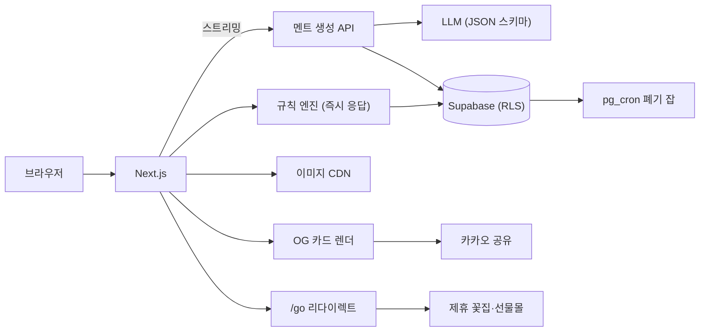

# 꽃 선물 추천 서비스 — 구현 계획서 v1

- 검토 대상: `flower_gift_platform_deep_research_2026-08-14.md`
- 검토 관점: 구현 우선 (비즈니스 모델·시장 수치는 판단 대상에서 제외)
- 작성일: 2026-08-14

---

## 0. 검증 결론 요약

| 구분 | 결론 |
|---|---|
| 전체 판정 | **구현 관점에서 방향 정확.** 스택 선택, 아키텍처, LLM 역할 제한, 8주 백로그 순서 모두 착수 가능한 수준 |
| 반드시 고칠 것 (3건) | ① 결과 공유 URL ↔ 추억 즉시 폐기의 **설계 모순** ② 1주차 자체 CMS 개발은 **일정상 무리** ③ **카카오 공유·네이버 검색** 등 국내 유통 채널 설계가 통째로 빠짐 |
| 보강한 것 | 결과 2층 저장 모델, 생성 스트리밍, 3톤 1회 호출, OG 카드 자동화, 익명 인증, 자동 폐기 크론, 프롬프트 인젝션 방어, 아웃링크 측정, 테스트 도구 확정, 플랫폼 적합성 판단, 레퍼런스 10곳 추가 |

---

## 1. 기획 확정안 (구현에 필요한 만큼만)

원문 Part I의 결정을 그대로 채택한다. 이 파일만 보고 개발을 시작할 수 있도록 핵심만 재수록.

**제품 한 줄**: 관계와 상황을 입력하면 꽃·꽃말·함께 줄 선물·실제로 쓸 멘트까지 한 번에 추천하는 관계형 선물 컨시어지.

**핵심 플로우**: 관계(6종) → 마음(6종) → 취향·안전 → 현실 조건 → 결과 3안(안전한/의미 있는/대담한 선택). 5문항 45초 이내.

**MVP 포함**: 꽃 30종·색상별 꽃말, 추천 3안+이유, 멘트 3톤, 사과문 응급실, 반려동물 필터, 저장·공유 카드, 제휴 아웃링크, 팀 카드 10명 베타.

**MVP 제외**: 자체 재고·배송, 실시간 꽃집 재고, SNS 자동 분석, 100종 도감, 가상 부케 이미지 생성 판매.

**핵심 KPI**: 5문항 완료율 60%, 멘트 복사·저장 35%, 카드 공유 15%, 아웃링크 클릭 12%.

---

## 2. 검증 상세

### 2.1 검증 통과 — 그대로 진행

| 원문 결정 | 판정 | 구현 메모 |
|---|---|---|
| Next.js App Router + TS 단일 코드베이스 | ✅ | 단, 도감(`/flowers`, `/meanings`)은 매 요청 SSR이 아니라 **SSG + ISR**(`generateStaticParams` + `revalidate`)로. 비용·속도·SEO 동시 해결 |
| Supabase(PostgreSQL + RLS) | ✅ | 추억·그룹 테이블 RLS 필수, 공개 도감 테이블은 읽기 전용 분리. 원문 판단 정확 |
| 이미지 CDN + srcset/AVIF/지연 로딩/히어로 우선 | ✅ | web.dev 권고와 일치. 전달 규격 640/960/1600/2560도 적절 |
| **LLM은 표현 변환만, 사실은 검수 DB에서** | ✅ | 이 문서에서 가장 잘한 결정. 환각·독성 오류·저작권 리스크를 구조적으로 차단. 절대 후퇴하지 말 것 |
| 서버 측 LLM 호출 + 구조화 JSON 출력 | ✅ | 키 노출 방지·형식 강제 모두 맞음. 스키마 검증·폴백은 3.4에서 보강 |
| 규칙 기반 점수 → 학습형 전환 | ✅ | 초기 데이터 없이 ML 불가. 가중치 조정은 admin 화면 대신 config 테이블로 시작(아래) |
| 반려동물 안전 필드 설계 | ✅ | 종/부위/심각도/출처/검수일 구조 그대로. LLM 추정 금지 원칙 유지 |
| 사과 UX(말 먼저, 가격 비례 금지, 심각 시 구매 CTA 약화) | ✅ | 인용 연구(Lewicki 6요소, 사과 선물 역효과) 실재하며 구현 규칙으로 잘 번역됨 |
| 8주 백로그 순서(데이터→화면→엔진→생성→안전→그룹→QA) | ✅ | 의존 순서 타당. 1주차 내용만 수정(2.2) |
| 멘트 원문을 분석 이벤트에서 제외 | ✅ | 이벤트 스키마로 강제(3.8) |

### 2.2 수정 필요 — 3건

**① 결과 영속성 ↔ 추억 폐기 모순**

`/recommend/result/[id]` 공유 가능 URL을 만들면서 "추억은 생성 후 짧은 시간 안에 폐기"를 동시에 약속하면, 폐기 후 결과 페이지의 개인화 멘트가 깨지거나 폐기 약속이 거짓이 된다. 해결: **결과를 2층으로 분리 저장**한다.

```text
recommendation_results
  id, owner_uid            -- 익명 uid 포함
  public_payload  (jsonb)  -- 꽃 3안, 꽃말+출처, 추천 이유, 대체 꽃  → 공유 URL이 읽는 층
  private_payload (jsonb)  -- 추억 반영 멘트                        → 소유자만, expires_at 적용
  expires_at, created_at

share_cards
  id, result_id, snapshot (jsonb)  -- 사용자가 '카드에 담기'를 눌러 확정한 텍스트만 복사
```

공유 링크는 public_payload와 share_cards만 렌더한다. 사용자가 멘트를 카드에 담는 행위 자체가 "이 문장은 공개해도 된다"는 동의가 되므로 폐기 정책과 충돌하지 않는다. 비로그인 사용자는 **Supabase 익명 로그인(`signInAnonymously`)** 으로 uid를 발급해 RLS를 동일하게 적용한다.

**② 1주차 자체 CMS(`/admin`) → 시트 + 시드 스크립트로 대체**

8주 안에 CMS·꽃 30종 입력·검수 흐름까지 만드는 것은 1인~소규모 팀 기준 무리. 대체:

- 구글 시트(또는 Notion DB)의 탭 = 엔터티(flowers / meanings / rules / templates / quotes / pet_safety)
- `pnpm seed` 실행 시 CSV export → **zod 스키마 검증** → 통과 시에만 DB upsert
- 출처·검수일·안전 상태가 빈 행이 있으면 시드 실패 → 원문의 "데이터 완전성 미달 시 배포 차단"이 CI에서 자동으로 구현됨
- 진짜 CMS는 운영 시작 후(단계 2)로 미룬다. 가중치 조정도 admin 화면 대신 `config` 테이블 1행(jsonb)으로

**③ 국내 유통 채널 설계 부재 → 2.3의 1~3번으로 추가**

문서의 공유·검색 전략이 OG 태그·구글 기준에 머물러 있다. 한국 서비스에서 공유율 15%·검색 유입은 카카오톡과 네이버 없이 달성하기 어렵다.

### 2.3 문서에 없던 구현 요소 — 추가 방안 12

1. **카카오톡 공유** — Kakao JS SDK `Share.sendCustom`(커스텀 템플릿: 결과 카드 이미지 + "나도 추천받기" 버튼 딥링크). 공유 KPI의 실질 채널.
2. **OG 카드 자동 생성** — `@vercel/og`(Satori)로 결과별 1200×630(링크 미리보기)과 4:5(저장·인스타용)를 서버 렌더. **한글 폰트 서브셋(WOFF)을 직접 전달해야** 깨지지 않음. 카톡·인스타에 뜨는 미리보기 자체가 획득 채널이 된다.
3. **네이버 검색** — 서치어드바이저 등록, 사이트맵 제출, 도감 페이지에 JSON-LD 구조화 데이터. 국내 꽃 검색은 네이버 비중이 커서 구글 SEO만으로는 부족.
4. **체감 속도 설계** — 추천 3안은 규칙 엔진+DB라 즉시 응답 가능. 화면에 꽃·꽃말·이유를 먼저 띄우고 **멘트만 스트리밍**으로 뒤따라 렌더. "5문항 완료율 60%"는 결과가 뜨는 속도가 좌우한다.
5. **3톤 1회 호출** — 톤별로 3번 호출하지 말고 한 번의 호출에서 JSON 배열로 3톤을 받는다. 비용·지연 1/3.
6. **프롬프트 인젝션 방어** — 사용자 추억 텍스트가 프롬프트에 들어가므로: 추억은 구분자 안의 '데이터'로만 취급, 시스템 규칙 고정, 출력은 zod 파싱 → 실패 시 1회 재시도 → 그래도 실패면 MessageTemplate 폴백. 원시 LLM 출력을 화면에 직접 렌더하지 않는다.
7. **자동 폐기 크론** — `expires_at` + Supabase **pg_cron** 일 1회 삭제 잡. "짧은 시간 안에 폐기"라는 문구를 실제 동작으로 만든다.
8. **앱 없이 리마인더** — 기념일·"다음엔 이렇게 할게" 약속을 **.ics 파일 다운로드**(캘린더 등록)로 제공. 구현 반나절, 푸시 없이 재방문 고리. 카카오 알림톡은 비즈니스 채널·사업자 등록이 필요하므로 후순위.
9. **아웃링크 측정** — 제휴 링크를 직접 걸지 말고 `/go/[partner]` 리다이렉트 엔드포인트에서 서버 기록 후 302. "클릭률 12%" KPI의 측정 기반. UTM 파라미터 표준화.
10. **심각 상황 게이트** — 사과 4단계 선택 + 위험 신호(폭력·강압·스토킹 관련 키워드)면 **LLM 호출 전에** 분기해 생성·구매 CTA를 막고 안전 안내 화면으로. 모델 판단에 맡기지 않고 앞단에서 차단.
11. **퍼블릭 도메인 세밀화 자산** — Biodiversity Heritage Library, Rawpixel 퍼블릭 도메인 컬렉션의 빅토리아 식물 세밀화를 브랜드 그래픽(빈 상태 화면, 카드 테두리, 도감 장식)으로 활용. 자체 촬영 30종이 완성되기 전의 비주얼 공백을 메우고 'Botanical Editorial' 정체성을 강화. 파일별 권리 표기 확인 습관은 원문 원칙대로 유지.
12. **(선택) Stateless 결과 URL** — id 저장 대신 입력값을 서명된 쿼리로 인코딩해 열 때마다 재계산하는 방식도 가능. 서버 저장이 0이 되지만 멘트가 매번 달라지는 문제가 있어, MVP는 ①의 2층 저장이 더 단순하다. 참고로만 기록.

---

## 3. 구현 계획 (착수용)

### 3.1 스택 확정

| 영역 | 확정 | 메모 |
|---|---|---|
| 프레임워크 | Next.js(App Router) + TypeScript | 도감 SSG+ISR / 추천 플로우 클라이언트 / API Route Handlers |
| 스타일 | Tailwind CSS | 모션은 CSS transition + 소형 라이브러리 1개 이내, `prefers-reduced-motion` 대응 |
| DB·인증 | Supabase (Postgres, RLS, 익명 로그인, pg_cron, Storage) | 원문 선택 유지 |
| 이미지 | Cloudinary + `next/image` 커스텀 loader | `f_auto,q_auto` + 명명 프리셋 고정. 무료 한도로 MVP 충분 |
| LLM | 서버 전용 1종, 구조화 JSON 출력 | 스트리밍 지원 모델. 폴백 템플릿 필수 |
| 분석 | PostHog(웹) + `/api/events` 서버 이벤트 | 자유 텍스트 속성 금지(3.8) |
| 공유 | Kakao JS SDK + `@vercel/og` | 한글 서브셋 폰트 동봉 |
| 배포 | Vercel + GitHub Actions(시드 검증·테스트) | 프리뷰 배포로 주간 리뷰 |
| 폰트 | 마루 부리(제목) + Pretendard(본문) | 둘 다 무료. 셀프호스팅 + 서브셋. 원문의 "감성 세리프 + 읽기 쉬운 산세리프"에 대한 국내 실전 답 |

### 3.2 전체 구조



### 3.3 저장소 구조

```text
src/
  app/
    (marketing)/          # SSG+ISR: /, /flowers/[slug], /meanings/[slug]
    (flow)/               # /recommend, /apology, /groups, /messages
    api/                  # recommendations, messages/generate, apology/review,
                          # groups, events, go/[partner], og/[cardId]
  lib/
    engine/               # 순수 TS 규칙 엔진 — 프레임워크·DB 독립
      exclude.ts          # 강제 제외(안전·예산·가용성·비선호)
      score.ts            # 가중 점수(가중치는 config에서 주입)
      diversity.ts        # 상위 3안 다양성 보정
      explain.ts          # 규칙 ID → 추천 이유 문장 매핑
    llm/                  # 프롬프트, zod 스키마, 스트리밍, 재시도·폴백
    safety/               # 사과문 패턴 검사, 심각 상황 게이트, 금칙어
    share/                # OG 렌더, 카카오 템플릿, .ics 생성
  db/migrations/  db/seed/
content/                  # 시트 export: flowers.csv meanings.csv rules.csv
                          # templates.csv quotes.csv pet_safety.csv
tests/engine/  tests/prompts/  tests/e2e/
```

핵심 원칙: **규칙 엔진은 순수 함수.** 원문 3주차 완료 조건 "고정 테스트 50건 통과"를 테이블 드리븐 단위 테스트로 그대로 구현할 수 있고, 나중에 앱·위젯으로 옮겨도 재사용된다.

### 3.4 핵심 모듈 계약

**엔진 시그니처**

```ts
recommend(input: RecoInput, data: RuleSet, weights: Weights): RecoResult[]
// RecoResult: { flower, fitScore, reasons: RuleId[], cautions: string[],
//               substitutes: FlowerRef[], availability: SeasonStatus }
```

- 처리 순서는 원문 22.1 그대로: 정규화 → 강제 제외 → 점수 → 다양성 → 설명.
- 가중치(원문 22.2의 I/R/S/A/P/D)는 `config` 테이블 jsonb에서 로드. 코드 수정 없이 조정, 변경 이력 컬럼으로 원문의 "규칙 버전 재현" 요구 충족.

**생성 API 계약**

- 요청: 원문 23.2 JSON 구조 유지(꽃말은 반드시 `meaning_source_id` 동봉).
- 응답: `{ tones: [{ tone, headline, message, why_it_fits, safety_flags[] }] }` — 3톤 1회 호출, 스트리밍.
- 실패 처리: zod 파싱 실패 → 재시도 1회 → MessageTemplate 폴백. 폴백률을 이벤트로 측정.
- 명언: `quotes` 테이블(`license: pd | original`) 밖의 인용 생성 금지. 기본 노출은 original.

**사과문 검사**

- 1차: 패턴 규칙 — 책임 전가 접속("미안한데 너도/네가"), 용서 압박("이제 풀어", "이 정도 했으면"), 조건부 사과("기분 나빴다면").
- 2차: LLM 분류(6요소 충족 여부를 구조화 라벨로). MVP는 1차만으로도 출시 가능, 2차는 5주차에 추가.

**공유 파이프라인**

카드에 담기(스냅샷 생성) → `/og/[cardId]` 이미지 렌더 → Kakao Share / 링크 복사 / 이미지 저장. 스냅샷에 없는 텍스트는 어떤 공유 경로로도 나가지 않는다.

### 3.5 API 확정 (원문 26.1 + 인증·제한 보강)

| 엔드포인트 | 인증 | 제한·검증 |
|---|---|---|
| `POST /api/recommendations` | 익명 uid | 안전·예산·가용성 강제 필터. rate limit: uid+IP 분당 |
| `POST /api/messages/generate` | 익명 uid | `meaning_source_id` 필수, 원문 로깅 금지, 일일 생성 상한(비용 가드) |
| `POST /api/apology/review` | 익명 uid | 심각 게이트 선행. 통과 못 하면 생성 호출 자체가 없음 |
| `POST /api/groups` / `.../generate` | 로그인 권장 | 최대 10명, 소유권 RLS, 중복·색상·오해 조합 검사 |
| `GET /api/flowers/[slug]` | 공개 | 공개 승인된 출처·이미지만. 실제로는 ISR 페이지가 대부분 흡수 |
| `POST /api/events` | 익명 uid | enum·수치만 허용, 자유 텍스트 속성 거부 |
| `GET /go/[partner]` | 공개 | 클릭 서버 기록 → 302. UTM 표준 부착 |
| `GET /og/[cardId]` | 공개 | share_cards 스냅샷만 렌더 |

### 3.6 8주 체크리스트 (원문 26.2 유지 + 수정 반영)

- [ ] **1주** — DB 마이그레이션, RLS 정책, 익명 로그인, ~~CMS~~ → 시트 템플릿 + 시드 스크립트(zod 검증 포함). 완료 조건: 꽃 5종이 시트→DB 왕복되고, 빈 필수 필드가 시드를 실패시킴
- [ ] **2주** — 홈·도감 ISR, 이미지 파이프라인(Cloudinary 프리셋, 히어로 priority), 폰트 서브셋, OG 기본 태그. 완료 조건: Lighthouse 모바일에서 LCP '좋음'
- [ ] **3주** — 5문항 플로우(한 화면 한 질문) + 규칙 엔진. 완료 조건: 고정 테스트 50건 통과
- [ ] **4주** — 결과 3안 화면(2층 저장), 카드에 담기, 카카오 공유·OG 카드. 완료 조건: 카톡에서 카드 미리보기가 올바르게 렌더
- [ ] **5주** — 멘트 3톤 스트리밍, 폴백, 프롬프트 회귀 테스트 셋. 완료 조건: 허구 추억·가짜 인용 시나리오 전부 차단
- [ ] **6주** — 사과 모드(패턴 검사 + 심각 게이트), 반려동물 필터 E2E. 완료 조건: 위험 시나리오에서 구매 CTA 미노출
- [ ] **7주** — 팀 카드 10명 베타(중복 보정, 4:5 내보내기), .ics 리마인더. 완료 조건: 10인 입력→카드 일괄 생성
- [ ] **8주** — 접근성·성능·분석 점검, `/go` 측정, 비공개 테스트 30~50명. 완료 조건: 핵심 경로 E2E 무오류 + 이벤트 대시보드 가동

### 3.7 테스트·품질 게이트 (도구 확정)

| 대상 | 도구 | 내용 |
|---|---|---|
| 규칙 엔진 | Vitest | 관계×상황×안전 테이블 드리븐 50케이스. PR 필수 |
| 데이터 완전성 | zod + CI | 시드 검증을 GitHub Actions 필수 잡으로 — 원문의 "비면 배포 차단" 구현체 |
| 프롬프트 회귀 | promptfoo | 허구 추억·가짜 명언·책임 전가·인젝션 시나리오 고정 셋 |
| E2E | Playwright | 첫 추천→공유→아웃링크 / 사과 심각 게이트 / 10명 카드 |
| 성능 | Lighthouse CI | LCP 히어로 priority+preconnect, 모든 이미지 width/height(CLS 0) |
| 접근성 | axe + 수동 | 키보드, 대체 텍스트, 명도 대비, reduced-motion |

### 3.8 분석 이벤트 스키마

`reco_start`, `reco_complete{duration_s}`, `result_view{variant}`, `msg_copy{tone}`, `card_create`, `card_share{channel}`, `out_click{partner}`, `apology_gate_shown`, `group_create{size}`, `llm_fallback{reason}`.

규칙: 속성은 enum·숫자만. 추억·멘트·사과문 **원문은 어떤 이벤트에도 싣지 않는다**(서버 검증으로 거부). 이 규칙이 원문 23.4 개인정보 원칙의 실행 장치다.

### 3.9 환경변수·비용 가드

```text
NEXT_PUBLIC_SUPABASE_URL / SUPABASE_ANON_KEY
SUPABASE_SERVICE_ROLE_KEY        # 서버 전용
LLM_API_KEY                      # 서버 전용
CLOUDINARY_URL
NEXT_PUBLIC_KAKAO_JS_KEY
POSTHOG_KEY
RESULT_TTL_HOURS / DAILY_GEN_LIMIT_PER_UID
```

비용 가드: uid당 일일 생성 상한, 3톤 1회 호출, 도감 ISR(SSR 비용 0에 수렴), Cloudinary 변환은 명명 프리셋만 허용(무한 변형 방지).

---

## 4. 구현 주의사항 12

1. **추억·멘트·사과문 원문을 로그·분석·모델 개선 어디에도 남기지 않는다.** 이벤트 스키마 서버 검증으로 강제.
2. **공유 경로에서 private_payload가 새는지 E2E로 확인.** 공유 URL·OG·카카오 템플릿 세 경로 모두.
3. **색상별 엔트리 = 촬영량 폭증.** 장미·튤립·카네이션만 색상 분리, 나머지는 대표색 1개로 시작(원문 30종 목표는 유지하되 엔트리 수를 통제).
4. **Unsplash만으로 도감 핵심 데이터셋을 만들지 않는다**(라이선스가 유사 서비스 구축을 제외). 파일별 라이선스 필드는 원문대로 유지.
5. **Satori(OG)에 한글 폰트를 넣지 않으면 카드가 깨진다.** 마루 부리·Pretendard 서브셋 WOFF를 렌더러에 동봉.
6. **LLM 출력은 반드시 스키마 파싱 후 렌더.** 원시 출력 직접 표시 금지 — 인젝션·형식 붕괴 방어의 마지막 줄.
7. **심각 상황은 생성 호출 전에 차단.** 안전 안내 화면에서는 꽃 구매 CTA를 노출하지 않는다.
8. **도감을 요청별 SSR로 만들지 않는다.** SSG+ISR. 검색 유입 페이지가 서버 비용을 만들면 안 됨.
9. **명언은 quotes DB 밖에서 생성 금지.** 프롬프트 규칙과 promptfoo 회귀 테스트 양쪽에 건다.
10. **국내 꽃 커머스에 공개 어필리에이트 프로그램이 거의 없다.** '수수료' 가정보다 `/go` 클릭 측정 + 수동 제휴 협의가 MVP의 현실. 측정부터 만들고 협상 근거로 쓴다.
11. **iOS 앱 전환 시 디지털 상품(팀 카드) 결제는 IAP 정책 대상.** 결제는 웹에 유지(5장 참고).
12. 원문 22.2의 수식 표기 `\[ \]`는 일반 마크다운에서 렌더되지 않음 — 개발 문서에는 코드블록으로 옮길 것(사소).

---

## 5. 플랫폼 적합성 판단 (웹 / PWA / iOS·Android)

**결론: MVP는 반응형 모바일 웹이 정답이고, 이 판단은 문서의 암묵적 전제와 일치한다.** 근거: 유입이 검색(도감)과 공유 링크(카톡)라서 설치 장벽 0이 절대적으로 유리하고, 사용 빈도가 기념일·갈등 순간에 몰려 있어 상시 설치 앱의 이점이 작으며, 8주 일정 안에 스토어 심사 변수를 넣을 이유가 없다.

| 옵션 | 적합성 | 판단 |
|---|---|---|
| 반응형 웹 (Next.js) | ◎ 지금 | 검색·공유 유입 구조와 정확히 일치. 8주 내 유일한 현실적 선택 |
| PWA 보강 | ○ MVP 직후 | manifest + 홈 화면 추가 + 오프라인 캐시. 웹 푸시는 iOS 16.4+에서 홈 화면 추가 시에만 가능해 도달률이 낮음 → 리마인더는 .ics·알림톡이 우선 |
| React Native (Expo) | △ 6개월+ | 리텐션·푸시 중심 단계가 검증된 뒤. TS·React 재사용으로 이 스택과 궁합 최상. 규칙 엔진(순수 함수)은 그대로 이식 |
| Capacitor 웹뷰 래핑 | △ | 최저 비용이지만 App Store 심사 4.2(최소 기능성)에서 순수 웹뷰는 리젝 위험 — 네이티브 기능(푸시·공유·위젯)을 얹어야 통과 가능 |
| Flutter / 순수 네이티브 | ✕ 현시점 | 웹 코드베이스와 이중 유지. 이 팀 스택에서 선택할 이유 없음 |

**앱 전환 트리거(셋 중 둘 이상 충족 시 착수)**: ① .ics·알림톡 리마인더의 재사용률이 유의미하게 나옴(푸시로 키울 근거) ② 월 재방문 주기가 데이터로 확인됨 ③ 팀 카드 등 유료 기능의 반복 결제 발생.

**스토어 주의사항**: 디지털 상품 결제를 앱에 넣으면 인앱결제 수수료·정책(지역별 상이, 변동 잦음) 대상이 되므로 **결제는 계속 웹에서** 처리하고 앱은 열람·알림 중심으로 설계. 실물 꽃 주문 중개는 외부 결제가 허용되는 영역이라 이 문제가 없다.

---

## 6. 디자인·비주얼 레퍼런스

### 6.1 원문 6곳 — 유지 (한 줄 요약)

| 레퍼런스 | 가져올 것 |
|---|---|
| FLOWERBX | 화면을 채우는 단일 품종 매크로 사진, 패션 에디토리얼 타이포 |
| Bloom & Wild | 관계·상황 중심 정보구조, 따뜻한 카피 톤 |
| Ode à la Rose | '받는 순간'까지의 디자인, 실물 검수 사진 신뢰 장치 |
| UrbanStems | 색·꽃·상황 필터와 비교하기 쉬운 카드 그리드 |
| Google Arts & Culture × RHS | 세로 스토리텔링, 꽃말의 역사·출처 표현 |
| Cornell Written in Petals | 출처 비교 아카이브 구조 |

### 6.2 추가 레퍼런스 10곳

| 레퍼런스 | 볼 것 | 우리 적용 |
|---|---|---|
| **토스 (toss.im)** | 한 화면 한 질문, 진행 마찰 제거, 한국어 마이크로카피의 교과서 | 5문항 추천 플로우의 화면 문법 표준 |
| **Typeform** | 대화형 폼의 진행률·전환 인터랙션 | 질문 전환 모션과 이탈 방지 패턴 |
| **29CM** | 상품을 에디토리얼로 파는 상세(PT) 구성 | "의미·이유 먼저, 가격 나중" 결과 화면의 국내 커머스 문법 |
| **Aesop (aesop.com)** | 세리프·여백·절제된 커머스 | Botanical Editorial 톤의 상업적 완성형 |
| **Ffern (ffern.co)** | 계절·소량 생산 서사의 보태니컬 에디토리얼 | 계절성(구매 가능성)을 미학으로 바꾸는 화법 |
| **내 트리를 꾸며줘 (colormytree.me, 산타파이브)** | 링크 공유→참여→재공유 루프, 시즌 한정 개봉(12/25) 장치로 국내 수백만 확산을 만든 구조 | 팀 부케·개인 카드의 공유 루프와 시즌 이벤트 설계의 국내 최고 선례 |
| **Kudoboard** | '여러 명→한 명' 단체 카드의 입력·초대 UX | 우리는 방향이 반대('한 명→여러 명')지만 명단 관리·일괄 편집 UI 참고 |
| **Function of Beauty / Warby Parker 퀴즈** | 개인화 퀴즈→결과 제시 화면 문법 | 결과 3안에 "당신의 입력 때문"이라는 근거를 붙이는 방식 |
| **Biodiversity Heritage Library / Rawpixel PD 컬렉션** | 빅토리아 식물 세밀화 퍼블릭 도메인 아카이브 | 레퍼런스이자 실제 그래픽 소재(빈 화면·카드 장식·도감) |
| **Awwwards** (ecommerce/flower 태그 탐색) | 수상작들의 모션 수위 | '과한 패럴랙스 금지' 원칙의 상한선 벤치마크 |

### 6.3 타이포·컬러 확정

- 제목·꽃 이름: **마루 부리**(네이버 무료 배포 세리프 — 원문의 "감성적인 명조" 요구에 대한 실전 답)
- 본문·버튼: **Pretendard**
- 컬러: 원문 10.2 팔레트(Warm Ivory / Ink / Deep Stem / Wine Rose / Apology Lavender / Pollen Gold) 그대로 채택. 사용 규칙만 추가 — 배경·중립 60 / 잉크·구조 30 / 포인트 10, 사과 모드 진입 시 포인트 컬러를 Lavender로 전환.
- 꽃말은 캡션이 아니라 주인공 문장으로 크게(원문 원칙 유지).

---

## 7. Day 1–3 착수 체크리스트

- [ ] 레포 생성: Next.js + TS + Tailwind 부트스트랩, Vercel 연결, 프리뷰 배포 확인
- [ ] Supabase 프로젝트 생성, 익명 로그인 활성화, 1차 마이그레이션(Flower / FlowerMeaning / RecommendationRule / config)
- [ ] 시트 템플릿 6탭 생성 → 꽃 5종만 입력 → `pnpm seed` 왕복 확인(zod 검증 포함)
- [ ] Cloudinary 계정·업로드 프리셋 고정, 마루 부리·Pretendard 서브셋 생성
- [ ] Kakao Developers 앱 등록(JS 키 발급). 네이버 서치어드바이저는 도메인 확정 후
- [ ] PostHog 프로젝트 생성, 이벤트 네이밍 규칙(3.8) 팀 문서화
- [ ] `lib/engine` 스켈레톤 + 첫 테스트 1건 통과 (exclude: 고양이 있음 → 백합류 제외)
- [ ] 상표·도메인 검색 10분: 꽃말해 / 꽃사이 (키프리스 + 도메인 등록처)
